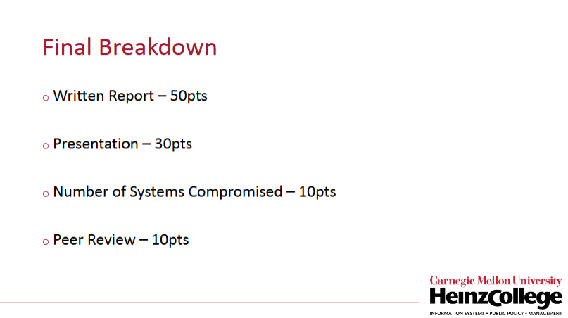
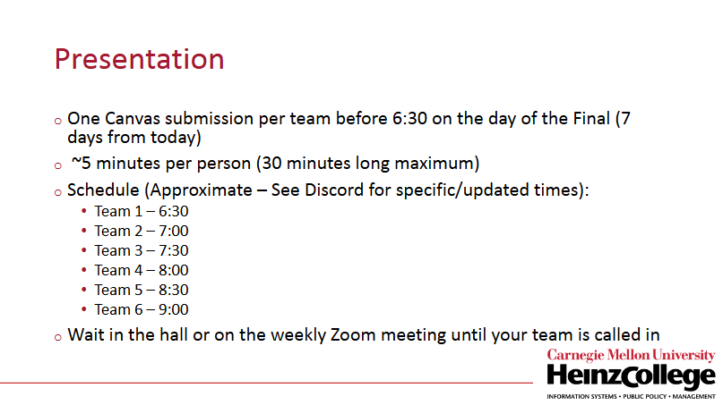
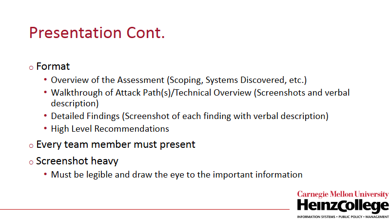
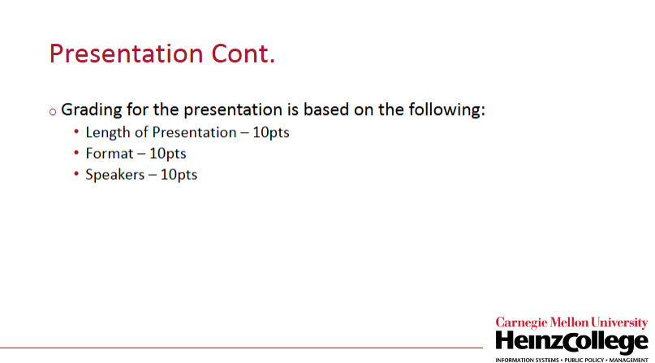
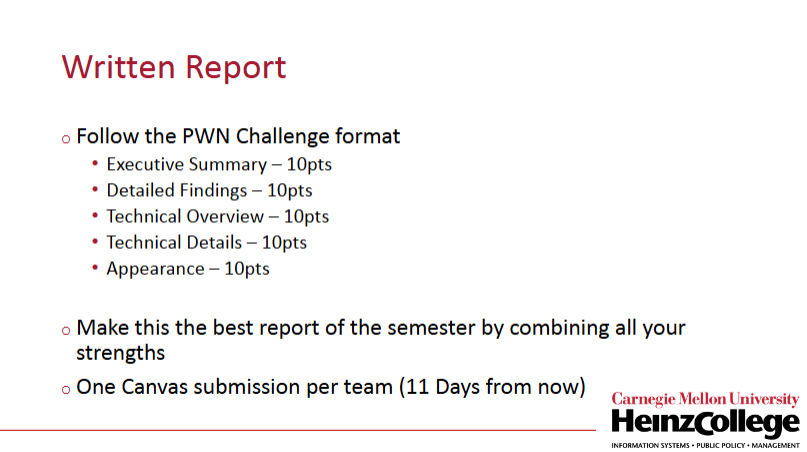
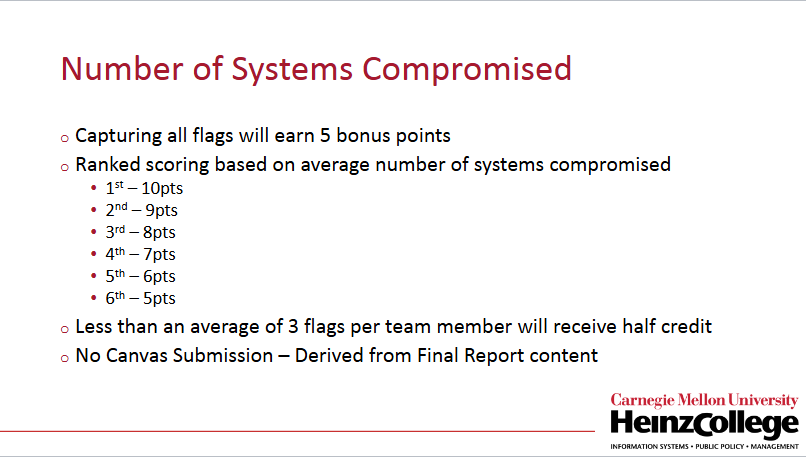
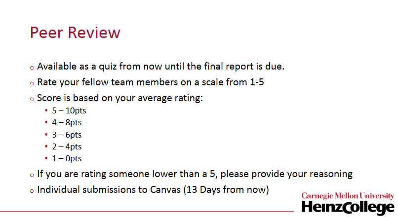

# Provided documents

Course PDFs, tool-tree screenshots, and other reference material live in this folder.

## Team Drive (final presentation + historical work)

Shared Google Drive for the **final presentation** and **historical** team artifacts (not a substitute for version control in this repo):

[EPT Final Project — Google Drive](https://drive.google.com/drive/folders/1HmTMpzZdm0Z97udgU8P0C70jRPTnjny7?usp=sharing)

---

## Final grading & presentation (slide screenshots)

Captures from the course **final breakdown** and **presentation / report** guidance. Confirm dates and Canvas rules on the live syllabus and Discord; treat these as **reference** only.

### Final grade breakdown (100 pts total)

### Presentation — logistics

### Presentation — format and content

### Presentation — grading components (30 pts)

### Written report — required sections (50 pts)

### Systems compromised (10 pts)

### Peer review (10 pts)

---

## Other paths in this folder

- [`Course_Tools_README.md`](Course_Tools_README.md) — tool tree navigation notes  
- [`Tool_Tree_Screenshots/`](Tool_Tree_Screenshots/) — tool tree images  
- Week PDFs and rubric PDFs in the root of `0_Provided_Docs/`

Back to repo root: [`../README.md`](../README.md)
