# Tool Tree Screenshots + Expanded Resource Tree

All provided menu-tree screenshots are stored in this folder and documented below.

## Screenshot set included

These new screenshots were copied into this folder:

- `tooltree_final_01.png`
- `tooltree_final_02.png`
- `tooltree_final_03.png`
- `tooltree_final_04.png`
- `tooltree_final_05.png`
- `tooltree_final_06.png`
- `tooltree_final_07.png`
- `tooltree_final_08.png`
- `tooltree_final_09.png`
- `tooltree_final_10.png`
- `tooltree_final_11.png`
- `tooltree_final_12.png`
- `tooltree_final_13.png`
- `tooltree_final_14.png`
- `tooltree_final_15.png`

---

## Kali menu tree (recreated from screenshots)

Use this as the living resource tree. Each tool has a brief purpose line.

### `01 - Information Gathering`

#### DNS Analysis
- `dnsenum`: enumerates DNS records, subdomains, and zone transfer hints.
- `dnsrecon`: DNS recon with record lookup and brute-force options.
- `fierce`: lightweight domain/DNS discovery.

#### IDS/IPS Identification
- `lbd`: detects load balancers and reverse proxies.
- `wafw00f`: detects web application firewalls.

#### Live Host Identification
- `arping`: discovers active hosts on local Layer-2 networks.
- `fping`: fast multi-host ICMP reachability tests.
- `hping3`: custom packet probing and host response testing.
- `masscan`: high-speed host/port discovery.
- `thcping6`: IPv6 probing utility.

#### Network & Port Scanners
- `masscan`: rapid large-scope port scanner.
- `nmap`: service/version/script-based scanning.

#### OSINT Analysis
- `maltego`: graph-based intel mapping.
- `theharvester`: collects emails, hosts, and metadata from public sources.

#### Route Analysis
- `netdiscover`: ARP discovery and local network mapping.
- `netmask`: subnet/CIDR calculator utility.

#### SMB Analysis
- `enum4linux`: SMB/NetBIOS enum helper for users/shares/policies.
- `nbtscan`: NetBIOS name service scanner.
- `smbmap`: share and permission mapping.

#### SMTP Analysis
- `swaks`: SMTP test client for mail server validation.

#### SNMP Analysis
- `onesixtyone`: SNMP community-string scanning.
- `snmp-check`: SNMP service information extraction.

#### SSL Analysis
- `ssldump`: SSL/TLS flow inspection.
- `sslh`: protocol multiplexer/detector helper.
- `sslscan`: cipher/protocol support checks.
- `sslyze`: detailed TLS posture analysis.

#### Additional tools seen in this tree
- `dmitry`: general recon utility.
- `ike-scan`: IKE/IPsec endpoint discovery.
- `recon-ng`: OSINT framework.

---

### `02 - Vulnerability Analysis`

#### Fuzzing Tools
- `spike-generic_chunked`: SPIKE fuzzing helper for chunked protocols.
- `spike-generic_listen_tcp`: SPIKE TCP listener fuzz workflow.
- `spike-generic_send_tcp`: SPIKE TCP sender fuzzing.
- `spike-generic_send_udp`: SPIKE UDP sender fuzzing.

#### Nessus Scanner
- `Nessus start`: starts Nessus service.
- `Nessus stop`: stops Nessus service.

#### VoIP / other entries
- `voiphopper`: VoIP VLAN hopping utility.
- `nikto`: web vulnerability scanner.
- `nmap`: vulnerability script scans and service checks.
- `unix-privesc-check`: Linux local privilege-escalation misconfig checker.

---

### `03 - Web Application Analysis`

#### CMS & Framework Identification
- `clusterd`: web framework/CMS clustering and detection helper.
- `wpscan`: WordPress vulnerability scanner.

#### Web Application Proxies
- `burpsuite`: intercepting proxy and web testing platform.

#### Web Crawlers & Directory Brute
- `cutycapt`: screenshot capture for web pages.
- `dirb`: directory/file brute-forcing.
- `dirbuster`: GUI content brute-force discovery.
- `wfuzz`: parameter/content fuzzing.

#### Web Vulnerability Scanners
- `cadaver`: WebDAV interaction client.
- `davtest`: WebDAV upload/exec testing.
- `nikto`: server and web misconfig scanner.
- `skipfish`: web application scanner.
- `whatweb`: web tech fingerprinting.
- `wpscan`: WordPress-specific scanner.
- `commix`: command injection automation.
- `sqlmap`: SQL injection automation.
- `ZAP`: OWASP ZAP web security scanner.

---

### `04 - Database Assessment`

- `SQLite database browser`: browse SQLite files.
- `sqlmap`: SQL injection testing/exploitation utility.

---

### `05 - Password Attacks`

#### Offline Attacks
- `chntpw`: Windows registry/SAM password editing utility.
- `hashid`: hash type identification.
- `hash-identifier`: hash format identification helper.
- `ophcrack-cli`: rainbow table hash cracking.
- `samdump2`: dumps Windows SAM hashes.

#### Online Attacks
- `hydra`: online login brute-force tool.
- `hydra-gtk`: GUI frontend for Hydra.
- `onesixtyone`: SNMP community brute-force.
- `patator`: modular brute-force framework.
- `thc-pptp-bruter`: PPTP auth brute-force.

#### Passing-the-Hash Tools
- `mimikatz`: credential and token manipulation utility.
- `pth-curl`: pass-the-hash curl wrapper.
- `pth-net`: pass-the-hash net utility wrapper.
- `pth-rpcclient`: PTH-enabled rpcclient wrapper.
- `pth-smbclient`: PTH-enabled smbclient wrapper.
- `pth-smbget`: PTH-enabled smbget wrapper.
- `pth-sqsh`: PTH-enabled SQL shell wrapper.
- `pth-winexe`: PTH-enabled remote command helper.
- `pth-wmic`: PTH-enabled WMIC wrapper.
- `pth-wmis`: PTH-enabled WMI shell wrapper.
- `pth-xfreerdp`: PTH-enabled RDP wrapper.
- `smbmap`: share validation with credential context.

#### Password Profiling & Wordlists
- `cewl`: generates wordlists from website content.
- `crunch`: custom wordlist generation.
- `rsmangler`: mutates base words into candidate passwords.
- `wordlists`: launcher/path to packaged wordlists.
- `john`: John the Ripper password cracker.
- `ncrack`: network authentication cracking tool.
- `ophcrack`: rainbow-table cracking GUI.

---

### `06 - Wireless Attacks`

#### 802.11 Wireless Tools
- `bully`: WPS PIN attack tool.
- `fern wifi cracker`: GUI wireless cracking wrapper.
- `aircrack-ng`: wireless auditing suite.
- `kismet`: wireless monitoring and discovery framework.
- `pixiewps`: Pixie-Dust WPS attack helper.
- `reaver`: WPS brute-force tool.
- `wifite`: automated wireless attack workflow.

#### Bluetooth Tools
- `spooftooph`: Bluetooth identity spoofing utility.

---

### `07 - Reverse Engineering`

- `clang`: C compiler for test builds/analysis.
- `clang++`: C++ compiler.
- `NASM shell`: assembler utility launcher.
- `radare2`: disassembly and reverse-engineering framework.

---

### `08 - Exploitation Tools`

- `armitage`: Metasploit collaboration GUI.
- `metasploit framework`: exploit/post framework.
- `msf payload creator`: payload generation helper.
- `searchsploit`: local ExploitDB search utility.
- `social engineering toolkit`: social engineering framework.
- `sqlmap`: SQL injection exploitation/testing.

---

### `09 - Sniffing & Spoofing`

#### Network Sniffers
- `dnschef`: fake DNS resolver for testing.
- `netsniff-ng`: packet capture/analysis toolkit.

#### Spoofing and MITM
- `dnschef`: DNS spoofing simulations.
- `rebind`: DNS rebinding testing helper.
- `sslsplit`: TLS interception utility.
- `tcpreplay`: replays packet captures.
- `ettercap-graphical`: GUI MITM/sniffing suite.
- `macchanger`: MAC address randomization.
- `mitmproxy`: interactive HTTP(S) intercept proxy.
- `netsniff-ng`: packet capture and replay utilities.
- `responder`: LLMNR/NBT-NS poisoning toolkit.
- `wireshark`: full packet capture/analysis UI.

---

### `10 - Post Exploitation`

#### OS Backdoors
- `dbd`: simple bind/reverse style shell utility.
- `powersploit`: PowerShell post-exploitation framework.
- `sbd`: encrypted netcat-like backdoor utility.

#### Tunneling & Exfiltration
- `dbd`: shell transport helper.
- `dns2tcpc`: DNS tunneling client.
- `dns2tcpd`: DNS tunneling server.
- `exe2hex`: converts binaries for script embedding.
- `iodine`: IP-over-DNS tunneling.
- `miredo`: Teredo IPv6 tunneling service.
- `proxychains`: forces tools through proxy chain.
- `proxytunnel`: tunnels through HTTPS proxies.
- `ptunnel`: ICMP tunneling.
- `pwnat`: NAT traversal helper.
- `sslh`: protocol multiplexer.
- `stunnel4`: TLS tunnel wrapper.
- `udptunnel`: UDP tunnel utility.

#### Web Backdoors
- `laudanum`: web shell/backdoor collection.
- `weevely`: PHP web shell toolkit.

#### Also shown in category
- `mimikatz`
- `powersploit`
- `proxychains`

---

### `11 - Forensics`

#### Forensic Carving Tools
- `magicrescue`: file carving from raw media.
- `scalpel`: signature-based file carving.
- `scrounge-ntfs`: NTFS recovery helper.

#### Forensic Imaging Tools
- `guymager`: forensic imaging and hashing GUI.

#### PDF Forensics Tools
- `pdfid`: suspicious PDF feature scanner.
- `pdf-parser`: PDF object analysis.
- `peepdf`: interactive PDF analysis toolkit.

#### Sleuth Kit suite (observed)
- `autopsy`: forensic GUI front-end.
- `blkcalc`: block address calculations.
- `blkcat`: reads raw blocks.
- `blkls`: extracts unallocated blocks.
- `blkstat`: block metadata viewer.
- `ffind`: finds file name by inode.
- `fls`: file and directory listing from image.
- `fsstat`: filesystem metadata summary.
- `hfind`: hash database lookup.
- `icat-sleuthkit`: file extraction by inode.
- `ifind`: inode lookup utility.
- `ils-sleuthkit`: inode listing.
- `img_cat`: reads image data.
- `img_stat`: image metadata.
- `istat`: inode metadata inspection.
- `jcat`: file extraction from journal.
- `jls`: journal listing.
- `mactime-sleuthkit`: timeline generator.
- `mmcat`: reads volume system sectors.
- `mmls`: partition layout listing.
- `mmstat`: volume system stats.
- `sigfind`: signature search utility.
- `sorter`: file sorting helper.
- `srch_strings`: string search tool.
- `tsk_comparedir`: compares image vs live dir.
- `tsk_gettimes`: gathers MAC times.
- `tsk_loaddb`: loads bodyfile into DB.
- `tsk_recover`: recovers deleted files.

#### Related tools shown nearby
- `binwalk`: firmware/file signature analysis.
- `bulk_extractor`: feature extraction from media.
- `hashdeep`: recursive hashing utility.

---

### `12 - Reporting Tools`

- `cutycapt`: webpage screenshot capture.
- `faraday IDE start`: starts Faraday service.
- `faraday IDE stop`: stops Faraday service.
- `maltego`: graph visualization for intel/reporting.
- `pipal`: password statistics report generator.
- `recordmydesktop`: desktop recording for evidence.

---

### `13 - Social Engineering Tools`

- `maltego`: OSINT/social graphing utility.
- `msf payload creator`: payload generation helper.
- `social engineering toolkit`: social engineering framework.

---

### `14 - System Services`

- `Nessus start`: start Nessus service.
- `Nessus stop`: stop Nessus service.

---

### `42 - Kali & OffSec Links`

- `Exploit Database`: exploit archive portal.
- `Kali Bugs`: issue tracker entry point.
- `Kali Docs`: official documentation.
- `Kali Forums`: community discussion.
- `Kali Linux`: project homepage.
- `Kali Tools`: tools catalog.
- `Kali Training`: training resources.
- `NetHunter`: mobile security platform.
- `Offensive Security Training`: OffSec training portal.
- `VulnHub`: practice VM repository.

---

### `Wine` tree observed (through Ruby uninstall)

- `Programs`
  - `AutoIt v3`
    - `AutoIt v3 Website`
    - `Browse Extras`
    - `AutoIt Help File`
    - `AutoIt Window Info (x64)`
    - `AutoIt Window Info (x86)`
    - `Check For Updates`
    - `Compile Script to .exe` entries
    - `Examples`
    - `Run Script`
    - `Run Script (x64)`
    - `Run Script (x86)`
    - `SciTE Script Editor`
  - `Python 3.4`
    - `IDLE`
    - `Python 3.4` launcher
    - `Python 3.4 Docs Server`
    - `Python 3.4 Manuals`
    - `Uninstall Python 3.4 (32-bit)`
  - `Ruby 1.8.7-p371`
    - `Documentation` entries
    - `Interactive Ruby`
    - `RubyGems Documentation`
    - `Start Command Prompt ...`
    - `Uninstall Ruby 1.8.7-p371`

---

## Embedded image gallery

### Earlier batch (folders `01`-`05` coverage)

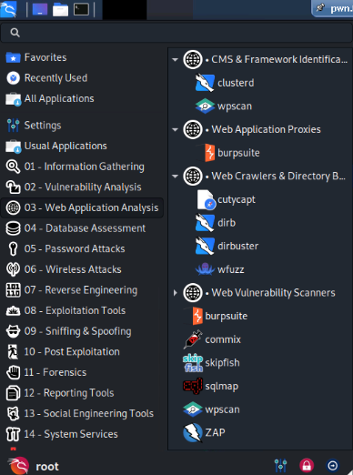
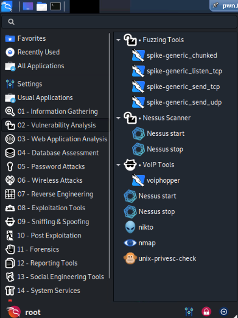
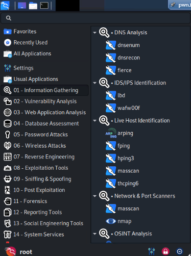
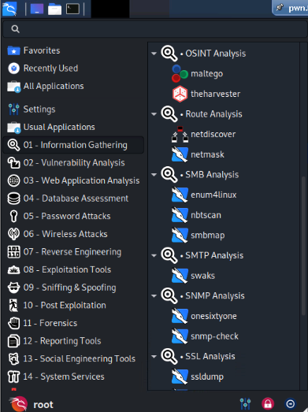
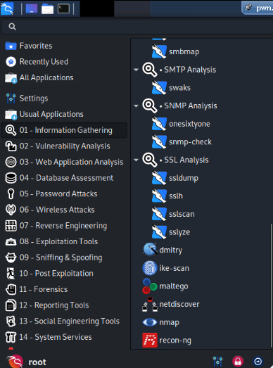

### Earlier batch (additional references)

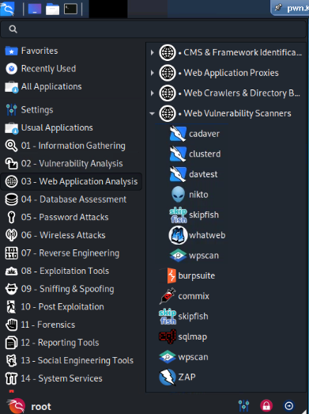
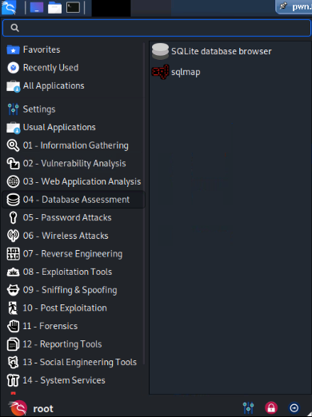
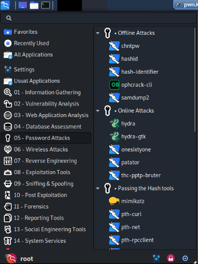
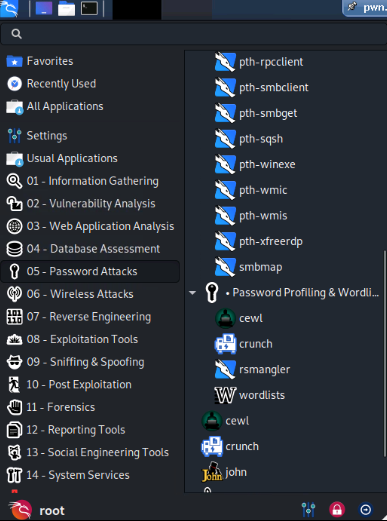
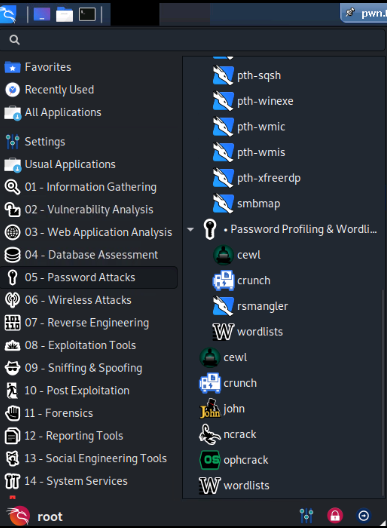

### Final batch

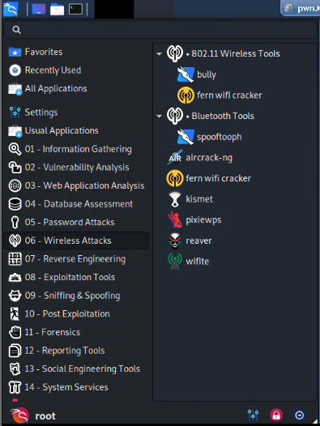
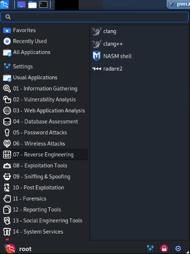
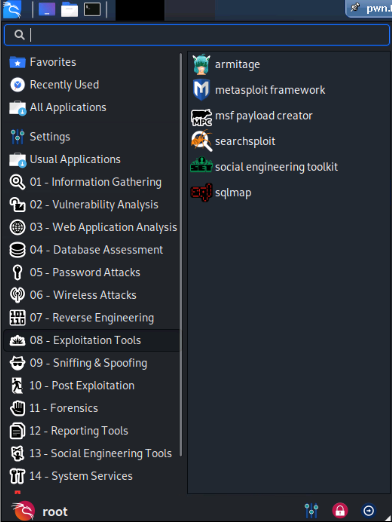
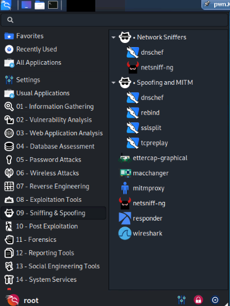
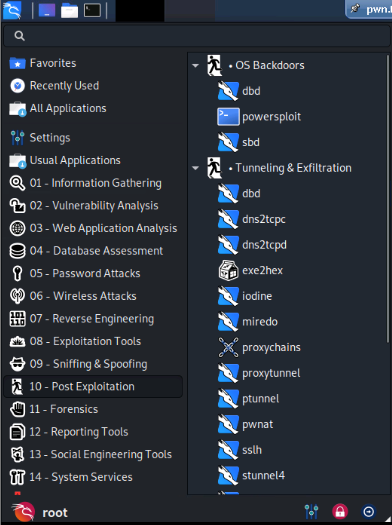
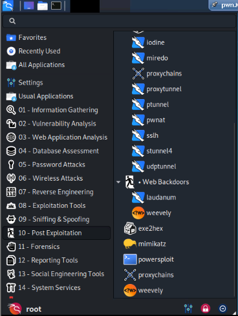
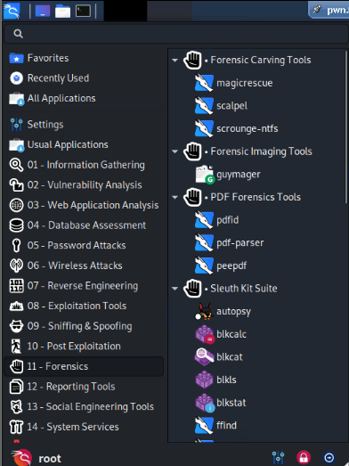
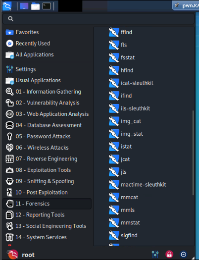
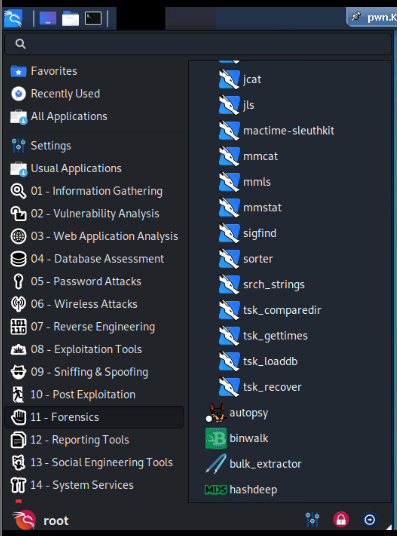
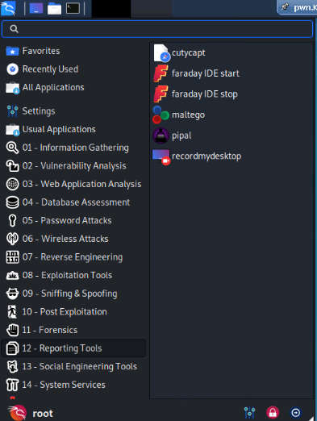
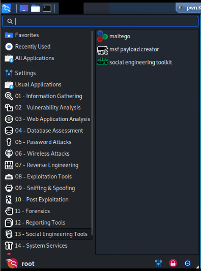
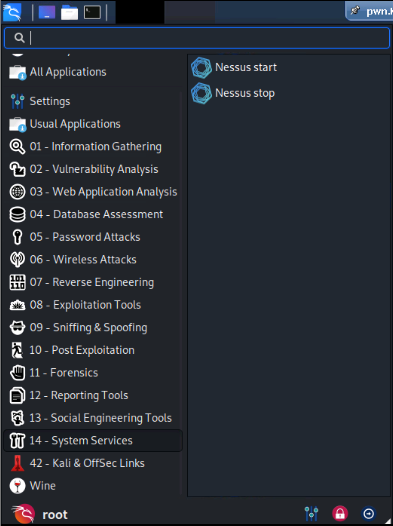
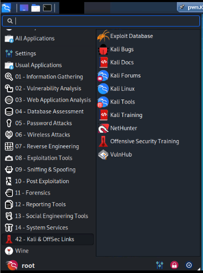
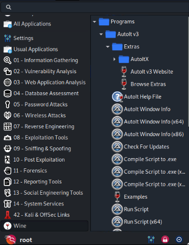
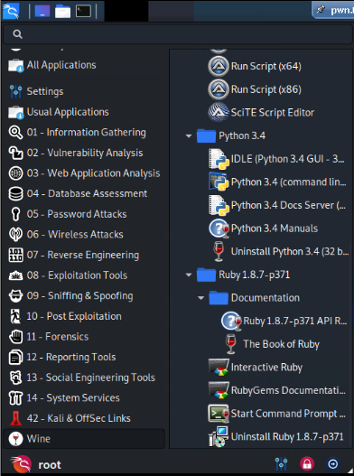
