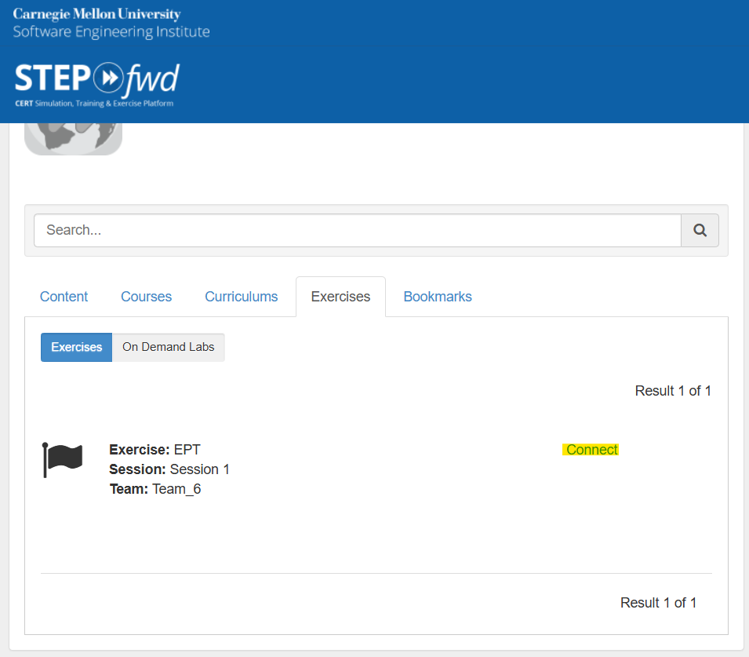
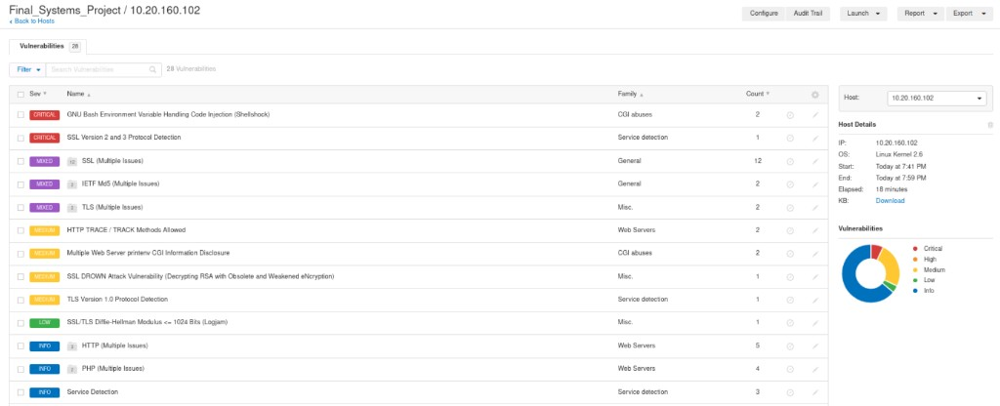
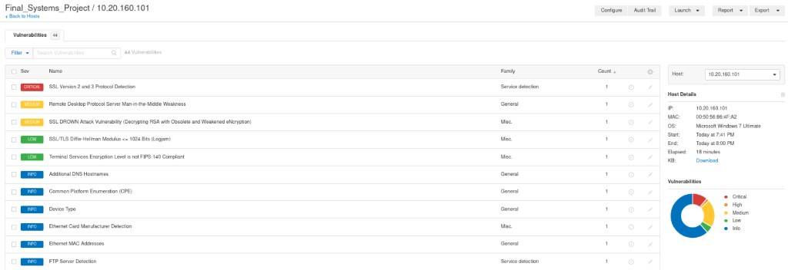
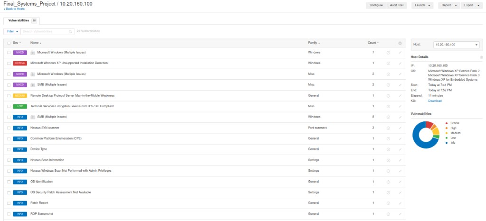

# A_Rocha — personal work folder

## Where to start (STEPfwd)

If you forgot how to open the lab environment:

1. Log in to **STEPfwd** (CERT Simulation, Training & Exercise platform — CMU Software Engineering Institute).
2. Open the **Exercises** tab (not Curriculums or Bookmarks).
3. Under Exercises, keep **Exercises** selected (not **On Demand Labs**).
4. Find the row **Exercise: EPT**, **Session: Session 1**, **Team: Team_6** (confirm session/team with the instructor if labels change).
5. Click **Connect** (the link on the right, often highlighted) to launch the exercise and reach your assigned **Kali** VM.

**This folder:** use [`work/`](work/) for logs, notes, and rough output; use [`Screenshots/`](Screenshots/) for draft captures. Promote **final** evidence to the team folder [`../1_Screenshots/`](../1_Screenshots/) when it is report-ready.

---

## Host_Discovery (master)

**Edit with the team and keep in sync with the root README host table:**

[Host_Discovery — Google Sheet](https://docs.google.com/spreadsheets/d/1J3H6ee8N06ROz1l4pcgxclArq5TN4sk3kIPbHPTCj3A/edit?usp=sharing)

**Default rule:** everyone should own **at least three** IPs in the lab range. You can **trade** hosts by updating the sheet, then mirror changes in [root `README.md`](../README.md) and each affected teammate’s `README.md`.

**Your Kali VM:** **KALI6** (same as PWN2). Use this machine for scans, exploits, and listeners so teammates do not overwrite each other’s work.

| Teammate | Kali VM |
|----------|---------|
| J_Solis | **KALI1** |
| T_Amor | **KALI2** |
| H_Padilla | **KALI3** |
| R_White | **KALI4** |
| B_Drummond | **KALI5** |
| A_Rocha | **KALI6** |

---

## Your hosts (you are responsible for these by default)

| Exploited? | IP | Ports | Network mapping scan | Vulnerability scan |
|------------|-----|-------|----------------------|--------------------|
| | `10.20.160.102` | | | |
| | `10.20.160.101` | 135; 139; 445; 49152; 49153; 49154; 49155; 49217; 49222 | | |
| | `10.20.160.100` | 139; 445 | | |

---

## Nessus — my hosts (specs + findings)

Scans were run as **Final_Systems_Project**. Raw screenshots: [`Screenshots/vulnerabilities/`](Screenshots/vulnerabilities/).

### `10.20.160.102` (Linux)

**Host details (from scan sidebar)**

| Field | Value |
|-------|--------|
| **IP** | 10.20.160.102 |
| **OS** | Linux Kernel 2.6 |
| **Scan start** | 7:41 PM |
| **Scan end** | 7:59 PM |
| **Elapsed** | 18 minutes |

**Findings (overview)** — Nessus reported **28** plugin rows for this host (see screenshot for full list). Notable severities include:

| Severity | Vulnerability (summary) | Family | Count (per table) |
|----------|-------------------------|--------|-------------------|
| Critical | GNU Bash Environment Variable Handling Code Injection (**Shellshock**) | CGI abuses | 2 |
| Critical | **SSL Version 2 and 3** Protocol Detection | Service detection | 1 |
| Mixed | SSL (multiple issues) | General | 12 |
| Mixed | IETF MD5 (multiple issues) | General | 2 |
| Mixed | TLS (multiple issues) | Misc. | 2 |
| Medium | HTTP **TRACE / TRACK** Methods Allowed | Web servers | 2 |
| Medium | Multiple Web Server **printenv** CGI Information Disclosure | CGI abuses | 2 |
| Medium | SSL **DROWN** Attack Vulnerability | Misc. | 1 |
| Medium | **TLS 1.0** Protocol Detection | Service detection | 1 |
| Low | SSL/TLS **Logjam** (DH ≤ 1024 bits) | Misc. | 1 |
| Info | HTTP, PHP, Service Detection, etc. | (various) | (see export) |

---

### `10.20.160.101` (Windows 7)

**Host details (from scan sidebar)**

| Field | Value |
|-------|--------|
| **IP** | 10.20.160.101 |
| **MAC** | 00:50:56:86:4F:A2 |
| **OS** | Microsoft Windows 7 Ultimate |
| **Scan start** | 7:41 PM |
| **Scan end** | 8:00 PM |
| **Elapsed** | 18 minutes |

**Findings (overview)** — **44** total findings (donut: Critical **1**, Medium **2**, Low **2**, Info **39**). Examples from the top of the table:

| Severity | Vulnerability (summary) | Family | Count |
|----------|-------------------------|--------|-------|
| Critical | **SSL Version 2 and 3** Protocol Detection | Service detection | 1 |
| Medium | **RDP** Server Man-in-the-Middle Weakness | General | 1 |
| Medium | SSL **DROWN** Attack Vulnerability | Misc. | 1 |
| Low | SSL/TLS **Logjam** (DH ≤ 1024 bits) | Misc. | 1 |
| Low | Terminal Services encryption **not FIPS-140** compliant | Misc. | 1 |
| Info | DNS hostnames, CPE, device type, Ethernet MAC vendor, **FTP** server detection, etc. | (various) | (see export) |

---

### `10.20.160.100` (Windows XP)

**Host details (from scan sidebar)**

| Field | Value |
|-------|--------|
| **IP** | 10.20.160.100 |
| **OS** | Microsoft Windows XP **Service Pack 2**; Microsoft Windows XP **Service Pack 3**; Windows XP for Embedded Systems |
| **Scan start** | 7:41 PM |
| **Scan end** | 7:52 PM |
| **Elapsed** | 11 minutes |

**Findings (overview)** — **20** total findings. Highlights from the table:

| Severity | Vulnerability (summary) | Family | Count |
|----------|-------------------------|--------|-------|
| Mixed | Microsoft Windows (**multiple issues**) | Windows | 7 |
| Critical | Microsoft Windows XP **Unsupported Installation** Detection | Windows | 1 |
| Mixed | Microsoft Windows (multiple issues) | Misc. | 2 |
| Mixed | **SMB** (multiple issues) | Misc. | 2 |
| Medium | **RDP** Server Man-in-the-Middle Weakness | General | 1 |
| Low | Terminal Services encryption **not FIPS-140** compliant | Misc. | 1 |
| Info | SMB (multiple issues), Nessus SYN scanner, CPE, device type, patch/OS notes, RDP screenshot, etc. | (various) | (see export) |

**Attack-surface takeaway:** End-of-life **Windows XP** plus **SMB** and **RDP**-related findings are the main story for validation in the lab.

---

## Checkpoints (CP)

| CP | Gate |
|----|------|
| CP0 | Setup: authorized scope, folder habit, confirm or swap IP ownership with team |
| CP1 | Discovery: your rows + sheet + root README stay aligned |
| CP2 | Mapping: services, attack surface, ruled-out paths for your IPs |
| CP3 | Exploitation: attempts documented (success or failure) |
| CP4 | Proof: `local.txt` / `proof.txt` (or equivalent) or explicit “blocked” |
| CP5 | Lateral / pivot if in scope; never commit secrets |
| CP6 | Report: hand figures and narrative snippets to integrator |
| CP7 | Submit: final checklist and rubric pass |

**Track here (GitHub checkboxes):**

- [ ] CP0 — Setup / ownership clear
- [ ] CP1 — Discovery updated for my IPs
- [ ] CP2 — Mapping notes for my IPs
- [ ] CP3 — Exploitation attempts logged
- [ ] CP4 — Proof or documented block
- [ ] CP5 — Lateral / pivot (if applicable)
- [ ] CP6 — Report handoff done
- [ ] CP7 — Submit-ready
