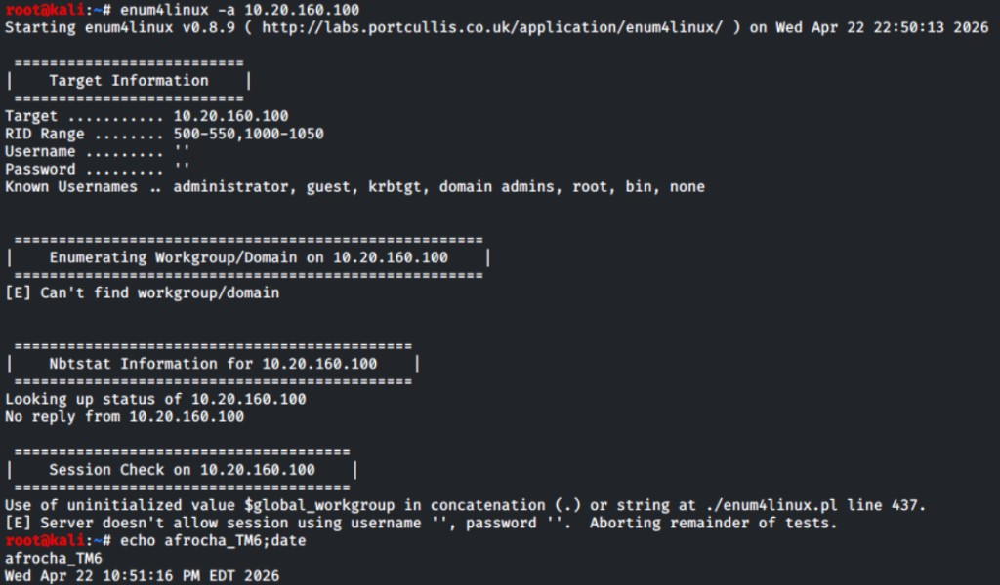
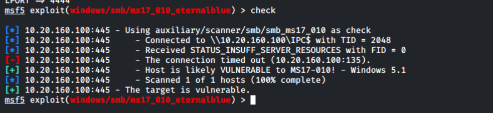

# Unfruitful / misleading lanes — `10.20.160.100` (ADRASTEA / XP)

This host’s **primary success** was **`ms08_067_netapi`**. The items below are **recon or wrong-tool noise** worth documenting so graders see you did not skip enumeration or confuse **XP** with **Win7/2008 R2** EternalBlue targets.

**Navigation:** [Host README](../README.md) · [Attack plan](../attack_plan/README.md) · [Screenshots folder](../Screenshots/) · [Work index](../../README.md)

---

## 1 — Null SMB enum blocked (`enum4linux`)

**What we tried:** **`enum4linux -a`** with empty creds.

**Outcome:** No NetBIOS reply / server does not allow **`''`/`''`** session — anonymous share listing **not** available on this run.

**Pivot:** Use **`nmap`** on **139/445** first, then **credentialed** SMB or **MSF** **`check`** on the **correct** exploit class — do not assume “null failed ⇒ host unreachable.”

---

## 2 — MS17-010 `check` noise on XP (`135` timeout vs “vulnerable”)

**What we tried:** **`ms17_010_eternalblue`** **`check`** (and related tooling).

**Outcome:** **RPC `135`** timeout lines alongside **“likely vulnerable”** style output — **misleading** on **XP**; **`ms17_010`** targets **7/2008 R2** pool grooming, not the **primary XP** lane. Prefer **`ms08_067`** when fingerprint is **XP SP3**.

**See also:** Full MSF notes in [host README](../README.md) (**XP vs EternalBlue**).

---

## 3 — Cross-host dead-end archive

- **CALLISTO (`.101`):** [../10.20.160.101/unfruitful_attempts/README.md](../10.20.160.101/unfruitful_attempts/README.md)  
- **Linux dotProject (`.102`):** [../10.20.160.102/unfruitful_attempts/README.md](../10.20.160.102/unfruitful_attempts/README.md)  
- **Central index:** [../../unfruitful_attempts/README.md](../../unfruitful_attempts/README.md)
