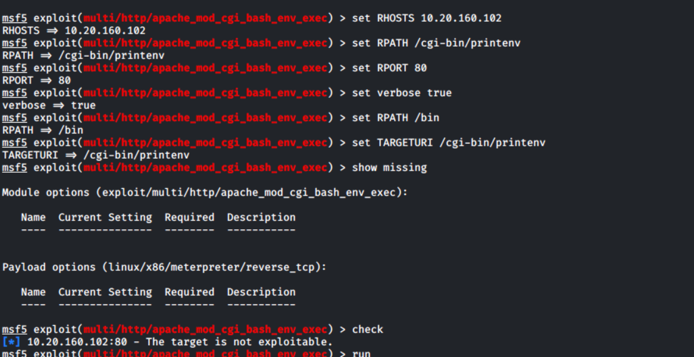
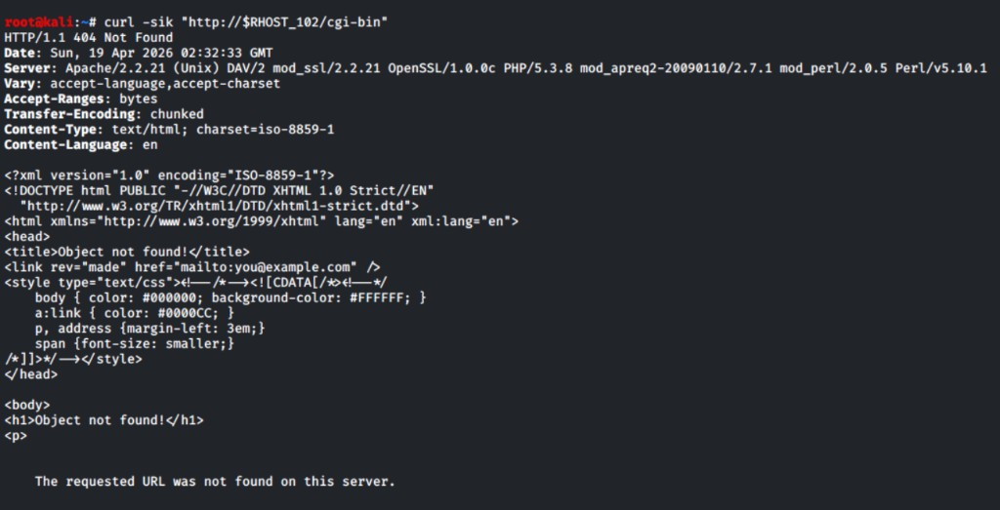
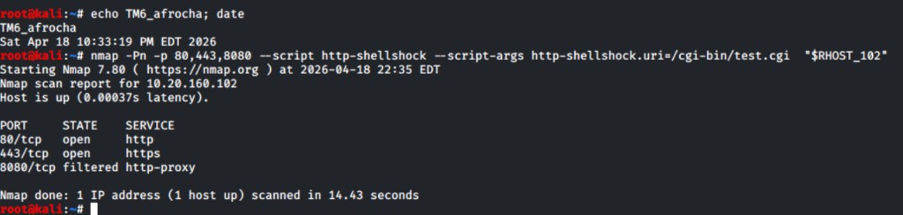
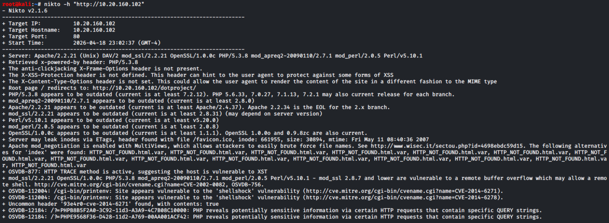
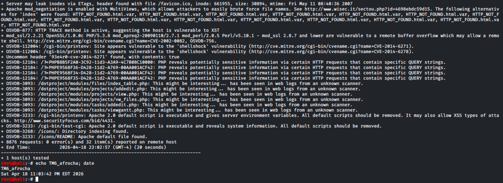
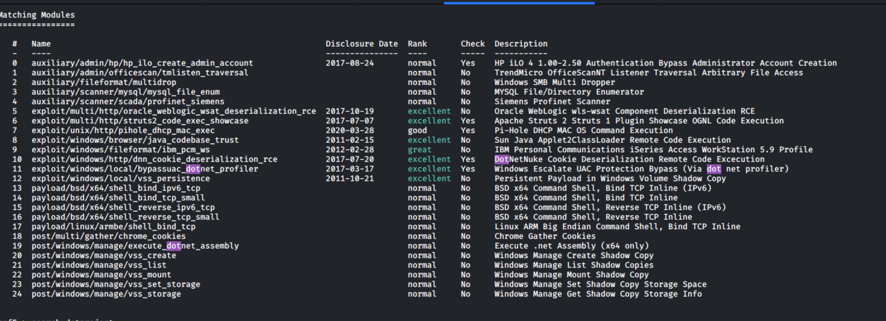
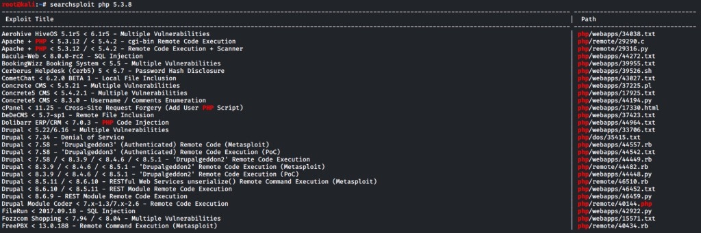
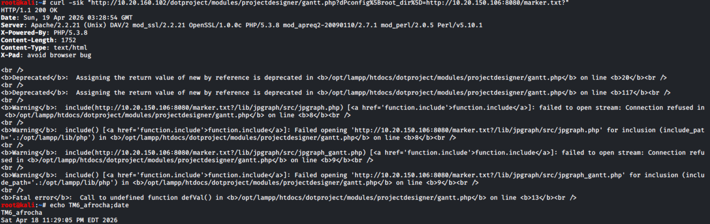

# Unfruitful attempts — `10.20.160.102` (Linux / dotProject)

Lanes that **did not** yield a shell or were **operator mistakes** before the **RFI** path worked. Screenshots are **embedded** below for quick report paste-in.

**Navigation:** [Host README](../README.md) · [Attack plan](../attack_plan/README.md) · [Screenshots folder](../Screenshots/) · [Work index](../../README.md)

---

## 1 — Shellshock / CGI / Metasploit (no shell via this lane)

**Hypothesis:** Nessus and banners suggested **Shellshock** via **`/cgi-bin/`**; **Nikto** flagged **`printenv`** / **`test-cgi`**.

| Attempt | What we ran | Outcome |
|---------|-------------|---------|
| Bare **`/cgi-bin`** | `curl` without script | **404** |
| **Nmap `http-shellshock`** | `http-shellshock.uri=/cgi-bin/test.cgi` | No **`http-shellshock:`** finding |
| **Nikto** | `nikto -h "http://$RHOST_102"` | Flags *appearing* Shellshock paths |
| **Metasploit** `apache_mod_cgi_bash_env_exec` | **`TARGETURI /cgi-bin/printenv`** | **`check`** → **not exploitable** |

**Note:** **`RPATH`** in that module is **CmdStager prefix** (`/bin`), **not** the CGI URL — only **`TARGETURI`** holds **`/cgi-bin/...`**.

### Evidence (embedded)

---

## 2 — Metasploit — no dotProject module; wrong `search dot`

| Attempt | Detail |
|---------|--------|
| **`search dot`** | Hits **DotNetNuke**, **dotnet**, etc. — **not** **dotProject**. |
| **`php_imap_open_rce`** | Wrong products; no stock **`/dotproject/`** URI. |

---

## 3 — `searchsploit` / generic PHP–Apache rows (not the winning path)

Many **Apache 2.2.21** / **PHP 5.3.8** rows target **other CMSs** or **php-cgi** layout; this host behaved as **mod_php**.

---

## 4 — RFI callback mistakes (before success)

| Issue | Fix |
|-------|-----|
| **Connection refused** from **`.102`** to Kali | Wrong **`LHOST`**, listener not **`0.0.0.0`**, or firewall. |
| **`proof.txt` 404** on Kali | **`http.server`** cwd ≠ file location. |
| **`curl https://…:8080`** to Python server | Use **`http://`** only. |

---

## 5 — Superseded plan (“Shellshock-first”)

Enumeration of **`/cgi-bin/`** remains valid **background**; primary **exploit** effort moved after **dotProject 2.1.6** + **`gantt.php`** **RFI** confirmation (**`102-004`** — see [host README](../README.md), winning lane).

---

## 6 — COA 2 — generic `searchsploit` catalogue (reference only)

**Winning lane:** **dotProject-specific RFI** (**EDB-22708**), not **CVE-2012-1823**-style **PHP-CGI** on this stack.

---

**Central index (all hosts):** [`../../unfruitful_attempts/README.md`](../../unfruitful_attempts/README.md)
